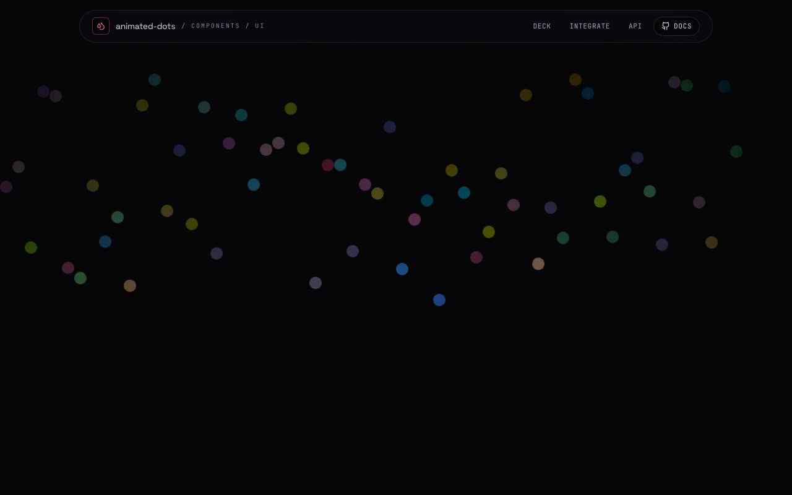

# Animated Dots Rain — Canvas Background Component (React + Vite + Tailwind CSS + shadcn)

[](./demo.mp4)

A shadcn/ui integration of **`AnimatedDots`** — a raw-`<canvas>` background where columns of dots rain down, each dot bleeding a single **R / G / B** channel from black to full saturation as it accelerates toward the bottom, then recycling with a fresh colour and speed. No Three.js, no Framer Motion, no assets — just React and one `requestAnimationFrame` loop. The showcase page is a component lab: a full-bleed live hero (the verbatim `demo.tsx`), a control deck wiring every real prop to a fader, copy-paste integration steps, and a full props API with the prompt's required Q&A. All fonts (Space Grotesk, Inter, JetBrains Mono) are vendored locally as woff2 for fully offline operation. Generated with Claude Fable 5.

## Stack

- **React 18** + **TypeScript** (strict)
- **Vite 6** with the `@/` → `src/` alias (shadcn convention)
- **Tailwind CSS v4** via `@tailwindcss/vite`
- **lucide-react** for the showcase chrome icons only
- Fonts (Space Grotesk, Inter, JetBrains Mono) **vendored locally** as woff2 — runs fully offline
- The component itself ships with **zero runtime dependencies**

## Run

```bash
npm install
npm run dev      # http://localhost:5173
npm run build    # tsc --noEmit + vite build
npm run verify   # headless Chromium CLI checks (boots dev server)
```

## The component

`src/components/ui/animated-dots.tsx` is the drop-in. Its public props:

| prop | type | default | notes |
| --- | --- | --- | --- |
| `dotsNum` | `number` | `60` | number of falling columns |
| `dotRadius` | `number` | `10` | dot radius (px), also column pitch |
| `dotSpacing` | `number` | `0` | extra gap added between columns |
| `speedRange` | `[number, number]` | `[1, 4]` | per-dot random fall acceleration |
| `backgroundColor` | `string` | `"transparent"` | per-frame canvas fill |
| `opacity` | `number` | `1` | `globalAlpha` for the dots |
| `blendMode` | `GlobalCompositeOperation` | `"source-over"` | `lighter` / `screen` glow on overlap |
| `fullScreen` | `boolean` | `true` | size to window vs. parent box |
| `colors` | `DotColor[]` | 16 stops | `[channel, r, g, b]` — channel ramps with the fall |
| `className` | `string` | `""` | wrapper classes |

Use it as a background: wrap it in a `relative`, sized container with `fullScreen={false}` and place content in a higher-`z` sibling.

---

Part of the [Components & UI](../) collection in the [claude-directory](../../) — an open-source gallery of AI-generated UI built with Claude Fable 5. [Browse the live gallery](https://pulkitxm.com/claude-directory).
