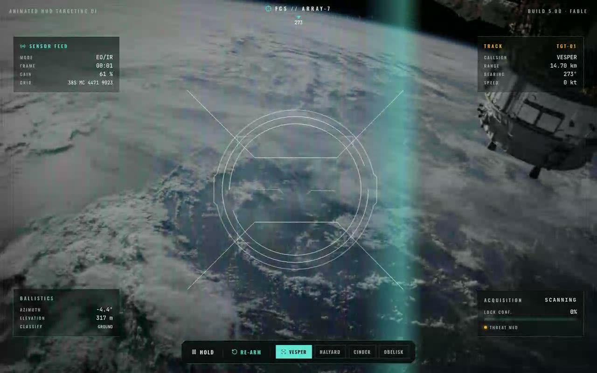

# Animated HUD Targeting UI — Avionics Fire-Control Display (React + Vite + Framer Motion + Tailwind CSS)

[](./demo.mp4)

A fire-control targeting display built around two shadcn-integrated primitives — `TargetingUI` (an animated SVG reticle that draws itself in: rounded scanner combs, diagonal sight lines, dual counter-rotating rings, chamber inserts and a bracketed center system) and `HudFrame` (a full-screen chamfered, notched clip-path frame). Instead of dropping the reticle on a flat background, this showcase runs it as a live avionics sensor display: vendored recon stills are framed by the HUD, and a small **acquisition state machine** sweeps the system through `SCANNING → ACQUIRING → TRACKING → LOCKED`. Each phase re-tints the reticle and re-draws it, telemetry ticks toward each target's track data, four L-brackets snap inward on lock, and the whole instrument speaks in one cold cyan/white palette with a single warm amber signal reserved for the moment of lock. Component lives in `src/components/ui/` as a shadcn-style primitive. Generated with Claude Fable 5.

## Run it

```bash
npm install
npm run dev       # http://localhost:5173
npm run build     # tsc --noEmit + vite build
npm run verify    # headless Playwright checks against `npm run preview`
```

## What it does

- **Acquisition loop** — `useAcquisition` is a `useReducer` state machine that dwells in
  each phase, advances on a timer, ramps a 0–100 lock-confidence value, and hands off to
  the next target after a full cycle. `Hold` freezes the clock; `Re-arm` restarts the
  current track; the four target chips jump to a track.
- **Reticle choreography** — the `TargetingUI` is keyed by `target.id + cycle`, so it
  remounts and replays its full draw-in sequence on every fresh acquisition. Its
  `pathColors` flip from white (scanning) → cyan (tracking) → amber (locked).
- **HUD chrome** — a scrolling **bearing tape** under the notch, a **pitch/roll horizon
  ladder** behind the reticle, four bracketed **corner readouts** (sensor feed, track,
  ballistics, acquisition), tabular-num counters that ease toward each value, a sensor
  sweep bar during scanning, and a lock flash + "TARGET LOCKED" stamp.

## The 5 prompt questions

- **What props get passed?** `TargetingUI` takes `className` + `pathColors {light, dark}`
  (the showcase drives `pathColors` per phase). `HudFrame` takes `children`,
  `backgroundImage`, `backgroundColor`, `backgroundVideo` (we pass `backgroundColor` and
  render the recon feed + chrome as children).
- **State management?** Local only. A `useReducer` acquisition machine plus a couple of
  `requestAnimationFrame` loops for telemetry drift and the horizon ladder. No external
  store. The reticle's own `useTheme()` is satisfied by a forced-dark `next-themes`
  `ThemeProvider` in `main.tsx`.
- **Required assets?** Four recon background stills (`public/assets/recon/`, Unsplash) and
  the UI fonts (JetBrains Mono + Oswald, `public/assets/fonts/`) — all **vendored locally**,
  nothing hotlinked. Icons come from `lucide-react`.
- **Responsive behavior?** Full-viewport. The frame's clip-path is percentage-based so the
  notch/chamfers stay centered; corner readouts shrink and reposition below `sm`, the
  control dock wraps, and the build tags hide below `lg`. The reticle scales with
  `min(58vh, 520px)`.
- **Best place to use it?** A loading/"processing" interstitial, a product hero for
  anything sensor/aerospace/security flavored, a game or simulation HUD, or a full-bleed
  showcase moment.

## Integration notes (answering the prompt)

This repo **already satisfies** the required stack, so no scaffolding was needed:

- **TypeScript** — `tsconfig.json`, `.tsx` sources.
- **Tailwind CSS v4** — via the `@tailwindcss/vite` plugin; styles in `src/index.css` with
  `@import "tailwindcss"`.
- **shadcn-style structure** — components under `src/components/ui`, imported through the
  `@` path alias.

### Why `/components/ui`

shadcn/ui's convention puts every primitive in `components/ui`. It matters because:

1. The shadcn CLI (`npx shadcn@latest add ...`) writes generated components there by default.
2. The `@/components/ui/...` import alias (set in `tsconfig` `paths`) resolves to that exact
   folder, so imports stay stable and predictable.
3. It separates reusable UI primitives from feature/composed components.

### If your project does NOT have the stack yet

```bash
# 1) Vite + React + TS
npm create vite@latest my-app -- --template react-ts && cd my-app

# 2) Tailwind v4
npm install tailwindcss @tailwindcss/vite
#   add the plugin to vite.config.ts and `@import "tailwindcss";` to your CSS

# 3) shadcn — sets up components.json, the @ alias, and components/ui
npx shadcn@latest init
#   then drop animated-hud-targeting-ui.tsx into src/components/ui/

# 4) Component dependencies
npm install framer-motion next-themes lucide-react
```

## What changed from the pasted source

- **The component is unchanged** — `TargetingUI` and `HudFrame` are copied verbatim
  (only whitespace/formatting was normalized by the formatter).
- **Added the `cn` helper** the component imports from `@/lib/utils` (a tiny dependency-free
  className joiner).
- **Replaced the pasted `demo.tsx`** with a full `App.tsx` showcase — the demo in the prompt
  was a minimal mount; this drives the reticle through a real acquisition loop with HUD chrome.
- **Wrapped the app in a forced-dark `next-themes` provider** so the reticle resolves its dark
  palette with no hydration flash.
- **Vendored fonts + recon images locally** instead of relying on remote CDNs.

## Stack

React 18, TypeScript, Vite 6, Tailwind CSS v4, Framer Motion, next-themes, lucide-react.

---

Part of the [Components & UI](../) collection in the [claude-directory](../../) — an open-source gallery of AI-generated UI built with Claude Fable 5. [Browse the live gallery](https://pulkitxm.com/claude-directory).
