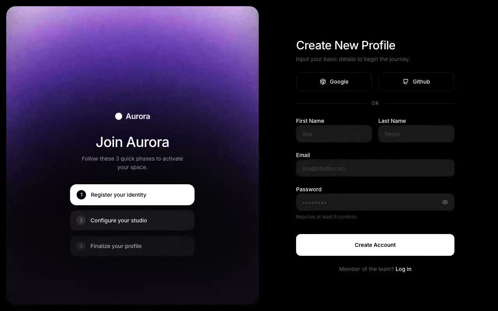

# Aurora Sign Up — Two-Column Registration UI with Video Hero (React + Tailwind CSS v4 + Motion)

[](./demo.mp4)

A modern two-column sign-up page featuring a full-bleed background video hero on the left and a polished registration form on the right. The left panel plays a looping muted video beneath a staggered entrance animation that reveals the brand, headline, and a three-step onboarding progress list; the right panel provides social auth buttons (Google, GitHub), an email/password form, and a password visibility toggle. Built for SaaS and creative-platform landing pages where first impressions matter. Generated with Claude Fable 5.

## Run

```bash
npm install
npm run dev       # dev server
npm run build     # type-check + production build
npm run preview   # serve the production build
npm run verify    # headless Playwright checks against the preview server
```

---

Part of the [Components & UI](../) collection in the [claude-directory](../../) — an open-source gallery of AI-generated UI built with Claude Fable 5. [Browse the live gallery](https://pulkitxm.com/claude-directory).
