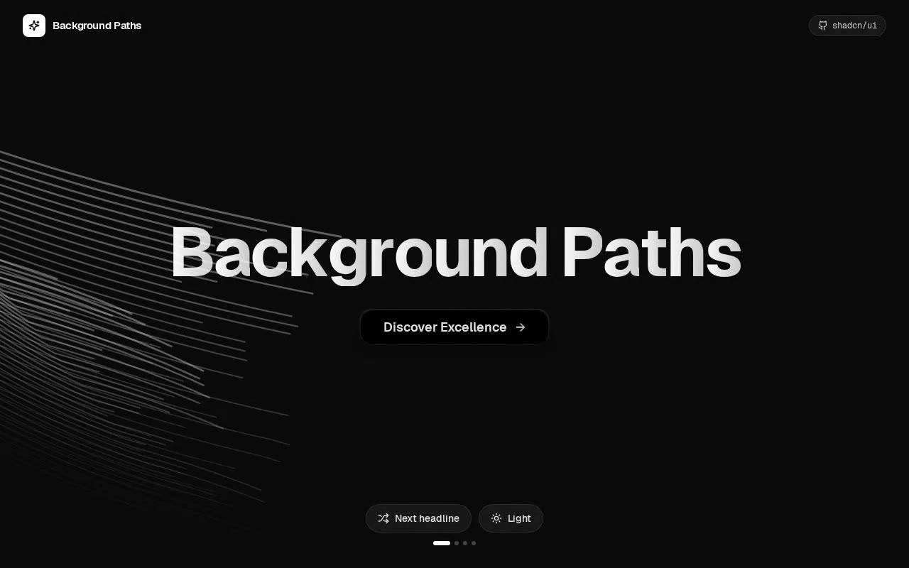

# Background Paths — Animated SVG Hero Component (React + shadcn/ui + Framer Motion)

[](./demo.mp4)

A full-screen landing hero built around the shadcn/ui Background Paths component: 72 flowing SVG paths drift across the canvas behind a per-letter spring-animated headline, topped by a glassmorphic call-to-action button. The showcase adds a dark/light theme toggle, a headline preset switcher, and a floating top bar — all written against Tailwind CSS dark-mode variants. Both Geist and Geist Mono fonts are vendored locally; the component ships zero runtime assets beyond inline SVG. A perfect drop-in hero section for marketing pages or app splash screens built on a shadcn/ui + Tailwind CSS + TypeScript stack. Generated with Claude Fable 5.

## What's in it

- **The integrated component** (`src/components/ui/background-paths.tsx`) — kept
  faithful to the source: two `FloatingPaths` layers (`position={1}` and
  `position={-1}`), each rendering 36 `motion.path`s whose `pathLength`,
  `opacity` and `pathOffset` loop forever on a randomized 20–30s linear cycle.
  The headline splits into per-word, per-letter `motion.span`s that enter on a
  stiff spring (`stiffness: 150, damping: 25`). The only additions over the
  original are two optional props — `ctaLabel` and `onCtaClick` — so the host
  page can wire the button up; the markup, classes and animations are unchanged.
- **A showcase around it** (`src/App.tsx`) that exercises the component the way
  a real app would:
  - a **theme toggle** (sun/moon) that flips the `dark` class on `<html>` — the
    component is written entirely against `dark:` variants, so this is its
    headline feature — with a smooth token crossfade and `localStorage` +
    `prefers-color-scheme` persistence;
  - a **preset switcher** (a "Next headline" pill, four progress dots, and the
    hero's own CTA) that swaps the `title`; a `key={title}` on the animated
    wrapper **replays the per-letter spring** on every change;
  - floating top bar (wordmark + shadcn/ui badge) and bottom dock, both glassy
    and theme-aware.
- **shadcn primitives** — the `Button` (`src/components/ui/button.tsx`) and the
  `cn` helper (`src/lib/utils.ts`) copied verbatim from the shadcn registry, the
  neutral HSL design tokens in `src/index.css`, and a real `components.json`.

## Integration notes (answering the prompt)

**Default paths.** `components.json` sets `aliases.ui` to `@/components/ui` and
`aliases.utils` to `@/lib/utils`; the `@` alias resolves to `src/` in both
`vite.config.ts` and `tsconfig.json`. The dropped-in component therefore imports
`@/components/ui/button` and `@/lib/utils` with no path edits.

**Why `/components/ui` specifically.** shadcn is not a dependency you `npm
install` — the CLI copies component source into *your* tree, and by convention
that lands in `components/ui`. Keeping primitives there means (1) the `ui` alias
in `components.json` resolves, so `npx shadcn@latest add …` and any component
that imports `@/components/ui/button` just work; (2) generated, registry-owned
primitives stay separate from your bespoke components; and (3) every shadcn
component shares one predictable location, so cross-imports never break.

**If you're starting from scratch:**

```bash
# 1. Vite + React + TypeScript
npm create vite@latest my-app -- --template react-ts && cd my-app
# 2. Tailwind (v3)
npm install -D tailwindcss@3 postcss autoprefixer && npx tailwindcss init -p
# 3. shadcn — scaffolds components.json, the @ alias, lib/utils and the tokens
npx shadcn@latest init
# 4. The Button this hero depends on
npx shadcn@latest add button
# 5. Runtime deps for the hero
npm install framer-motion @radix-ui/react-slot class-variance-authority
```

Then drop `background-paths.tsx` into `src/components/ui/` and render
`<BackgroundPaths title="Background Paths" />`.

**The "Questions to Ask," answered for this component:**

- **Props/data** — `title` (the headline; words split for the stagger),
  `ctaLabel`, and `onCtaClick`. No data fetching.
- **State** — none inside the component. The showcase owns theme + preset state.
- **Assets** — none required. It's pure inline SVG, so no images are needed; the
  UI chrome uses **lucide-react** icons. (No Unsplash images were warranted —
  adding stock photos behind the paths would only muddy the effect.)
- **Responsive behaviour** — the heading scales `text-5xl → sm:text-7xl →
  md:text-8xl`; the SVG is `w-full h-full` inside a `min-h-screen` flex-centered
  container, so it fills any viewport.
- **Best placement** — a top-of-page / landing hero or a full-screen splash.

## Assets

Fully self-contained — there are **no remote requests at runtime**. The
**Geist** and **Geist Mono** fonts are vendored under `public/fonts/` (sourced
from `github.com/vercel/geist-font`) and declared with `@font-face` in
`src/index.css`. All visuals are inline SVG + Tailwind; icons are bundled from
`lucide-react`.

## Run

```bash
npm install
npm run dev       # dev server
npm run build     # type-check + production build
npm run preview   # serve the production build
npm run verify    # headless Playwright checks against the preview build
```

`npm run verify` boots the production preview and asserts the 72 paths render
and animate, the per-letter headline settles, the CTA cycles the title, the
theme toggle flips `dark` and repaints, and the fonts load locally with no
remote font requests and no console errors.

---

Part of the [Components & UI](../) collection in the [claude-directory](../../) — an open-source gallery of AI-generated UI built with Claude Fable 5. [Browse the live gallery](https://pulkitxm.com/claude-directory).
