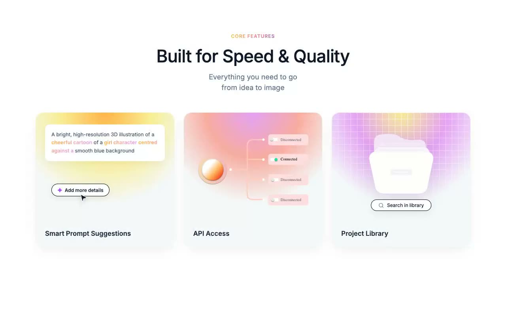

# Core Features — Gradient Cards Marketing Section (Plain HTML + CSS)

[](./demo.mp4)

A static "Core Features" marketing section composed of a centered header block and three gradient feature cards (Smart Prompt Suggestions, API Access, Project Library), built as plain HTML with a single inline `<style>` block. The design uses CSS `radial-gradient` and `linear-gradient` card backgrounds, gradient-clipped text via `-webkit-background-clip: text`, a responsive 3→2→1 column grid, inline SVG icons, and a masked grid mesh overlay — no JavaScript, no framework, no build step. Warm golds, rose, and violet over a paper-white page make it well-suited as a marketing features section for AI product or creative-tool landing pages. Generated with Claude Fable 5.

## Run

This is a static project — open `index.html` in a browser, or serve the folder:

```sh
python3 -m http.server 8000
```

See `prompt.md` for the full build spec; `demo.mp4` shows it in motion.

---

Part of the [Components & UI](../) collection in the [claude-directory](../../) — an open-source gallery of AI-generated UI built with Claude Fable 5. [Browse the live gallery](https://pulkitxm.com/claude-directory).
