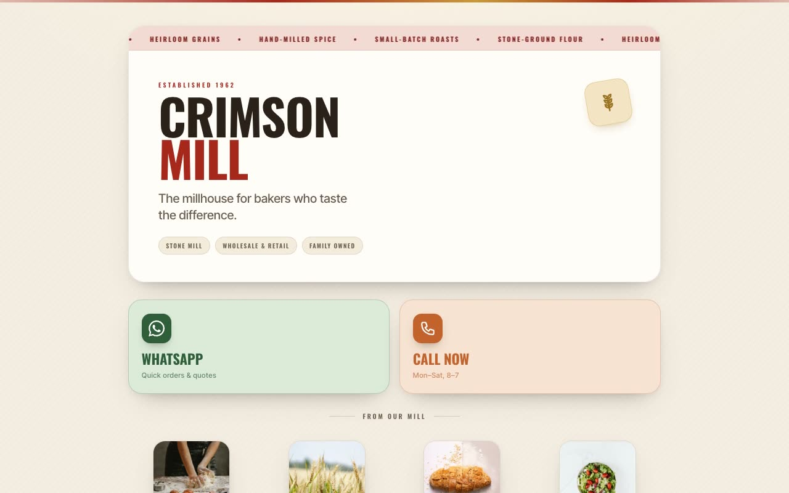

# Crimson Mill — Heritage Stone-Mill Digital Visiting Card (Vanilla HTML + CSS + JS)

[](./demo.mp4)

A vertical, mobile-first digital visiting card for Crimson Mill, a fictional heritage stone-mill supplier ("Stone-Ground Since 1962"). The page stacks rounded, soft-shadowed cards on a warm paper-cream canvas: a branded hero with an infinite marquee ticker, a two-up tap-to-contact grid, a product showcase gallery, a flagship-store location block with a pulsing "open" dot, and an hours/footer strip — each section revealed on scroll via `IntersectionObserver`. The "Millstone Craft" design language uses paper-cream `#F4EDE1`, ink-charcoal type `#2B2118`, brick-crimson accent `#A6271C`, and wheat-gold `#C99A3C`, with condensed Oswald uppercase paired with Inter Tight — evoking a stamped flour-sack label more than generic SaaS. Built as a self-contained static project (HTML + CSS + vanilla `script.js`, no build step) with all fonts and assets vendored locally. Generated with Claude Fable 5.

## Run

This is a static project — open `index.html` in a browser, or serve the folder:

```sh
python3 -m http.server 8000
```

See `prompt.md` for the full build spec; `demo.mp4` shows it in motion.

---

Part of the [Components & UI](../) collection in the [claude-directory](../../) — an open-source gallery of AI-generated UI built with Claude Fable 5. [Browse the live gallery](https://pulkitxm.com/claude-directory).
