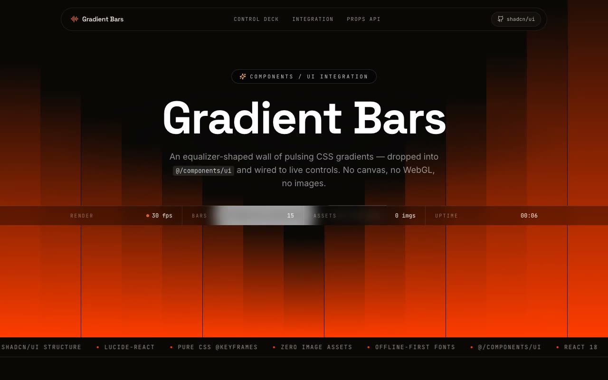

# Gradient Bars — Animated CSS Equalizer Background Component (React + shadcn/ui + Tailwind CSS)

[](./demo.mp4)

A shadcn/ui integration of the `GradientBars` background component: a wall of pulsing vertical CSS `linear-gradient` bars shaped like an equalizer, staggered via `@keyframes scaleY` animation for a rolling-wave ripple — no canvas, no WebGL, no images. The verbatim component lives at `@/components/ui/gradient-bars-background.tsx` and is wrapped in a full "component lab" page with a live hero, an interactive control deck (bar count, color picker, six presets, background color), a copyable usage snippet, a props API table, and integration story for shadcn/ui projects. Ideal as a dramatic animated background for dark-mode landing pages or loading screens. Generated with Claude Fable 5.

## What's inside

- **Hero** — a full-bleed live `<Component numBars={15} />` behind the
  "Gradient Bars" headline, a glass pill nav, and a live render-FPS / bars /
  asset-count / uptime telemetry strip, plus an animated stack ticker.
- **Control deck** — a second live `<GradientBars />` instance with faders wired
  straight to its real props (`numBars`, `animationDuration`), a `gradientFrom`
  colour picker with the prompt's six named presets, and a `backgroundColor`
  control. A copyable "live usage" snippet mirrors your current settings exactly.
- **Integration story** — answers the prompt directly: the supported-stack check
  (shadcn structure, Tailwind CSS, TypeScript), `shadcn` CLI setup commands, the
  single `lucide-react` dependency (the component itself ships **zero** runtime
  deps), the default component/style paths and **why `/components/ui` matters**,
  and the verbatim component source in a copyable code panel.
- **Props API & notes** — a props table for all five `GradientBars` props plus
  the two wrapper-only props (`backgroundColor`, `children`), and the prompt's
  required Q&A: data/props, state, assets, responsive behaviour, and best
  placement.
- **Footer** — a short reprise bar field fading into the canvas.

## Stack

React, TypeScript, Vite, Tailwind CSS v4, shadcn structure, Lucide.

The component itself needs **no assets** — every bar is a pure CSS
`linear-gradient`. Lucide icons are used only for the showcase chrome. All three
fonts (Space Grotesk, Inter, JetBrains Mono) are vendored locally as woff2, so
the project runs fully offline. The verbatim `demo.tsx` is kept byte-faithful as
reference (it is excluded from the strict typecheck since it is documentation,
not part of the app bundle).

## Run it

```bash
npm install
npm run dev      # vite dev server
npm run build    # tsc --noEmit && vite build
npm run verify   # headless Chromium checks (boots dev server, drives the page)
```

## Verification

`npm run verify` boots the dev server and drives a headless Chromium through the
page, asserting: the page loads with no console errors / failed requests, the
verbatim `GradientBars` layer mounts and paints its `linear-gradient(to top, …)`
bars, the `pulseBar` `@keyframes` animation is genuinely running (the bar
transform matrix advances over time), the control-deck `numBars` fader re-renders
the live preview and the usage snippet, a colour preset updates the preview's
reported `rgb()`, every showcase section is present, and the props API documents
all seven props.

---

Part of the [Components & UI](../) collection in the [claude-directory](../../) — an open-source gallery of AI-generated UI built with Claude Fable 5. [Browse the live gallery](https://pulkitxm.com/claude-directory).
