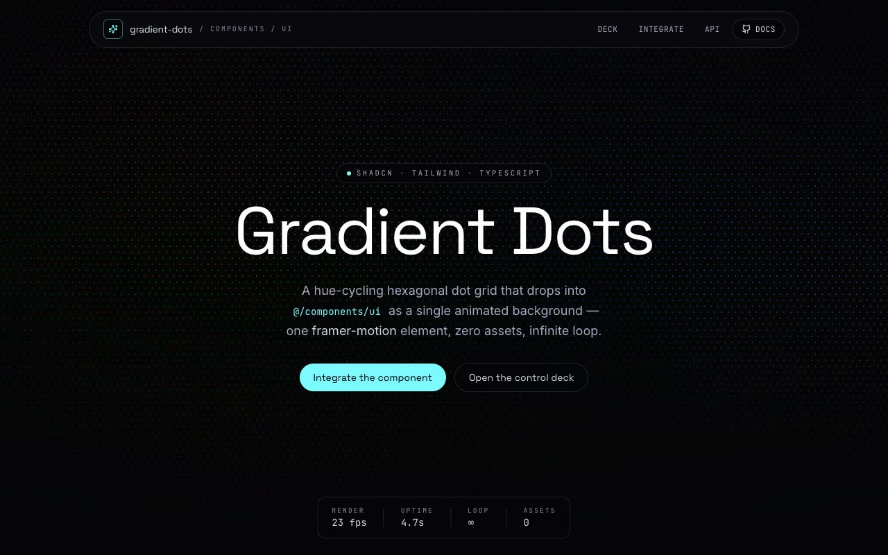

# Gradient Dots — Hue-Cycling Hexagonal Dot-Grid Background (React + shadcn/ui + Framer Motion)

[](./demo.mp4)

A shadcn/ui integration of the `GradientDots` component: a hue-cycling hexagonal dot-grid animated background painted entirely with six layered CSS `radial-gradient`s and driven by Framer Motion — no canvas, no images, no assets. The verbatim component lives at `@/components/ui/gradient-dots.tsx` and is wrapped in a polished "component lab" page with a live hero, an interactive control deck (dot size, spacing, animation duration, color cycle, background color, named presets), a copyable usage snippet, and a full props API table. Perfect as a living background for dark-mode landing pages, splash screens, or hero sections. Generated with Claude Fable 5.

## What's inside

- **Hero** — the verbatim `demo.tsx`, scaled up: a full-bleed live
  `<GradientDots />` behind the "Gradient Dots" headline, a glass pill nav, and
  a live render-FPS / uptime / loop / asset-count telemetry strip.
- **Control deck** — a second live `<GradientDots />` instance with faders wired
  straight to its real props (`dotSize`, `spacing`, `duration`,
  `colorCycleDuration`) plus a background colour control and named presets. A
  copyable "live usage" snippet mirrors your current settings.
- **Integration story** — answers the prompt directly: the supported-stack check
  (shadcn structure, Tailwind CSS, TypeScript), `shadcn` CLI setup commands,
  the default component/style paths and **why `/components/ui` matters**, the
  single `framer-motion` dependency, and the verbatim component + demo source in
  copyable code panels.
- **Props API & notes** — a props table for all five props (plus the forwarded
  `motion.div` props) and the prompt's required Q&A: data/props, state, assets,
  responsive behaviour, and best placement.

## Stack

React, TypeScript, Vite, Tailwind CSS v4, framer-motion, shadcn structure,
Lucide.

The component itself needs **no assets** — the dot field is pure CSS. Lucide
icons are used only for the showcase chrome. All three fonts (Space Grotesk,
Inter, JetBrains Mono) are vendored locally as woff2, so the project runs fully
offline.

## Run it

```bash
npm install
npm run dev      # vite dev server
npm run build    # tsc --noEmit && vite build
npm run verify   # headless Chromium checks (boots dev server, drives the page)
```

## Verification

`npm run verify` boots the dev server and drives a headless Chromium through the
page, asserting: the page loads with no console errors / failed requests, the
`GradientDots` layer mounts and paints its 6 layered radial-gradients,
framer-motion is genuinely animating (`background-position` advances), the
control-deck fader updates the live preview and usage snippet, every showcase
section is present, and the props API documents all five props.

---

Part of the [Components & UI](../) collection in the [claude-directory](../../) — an open-source gallery of AI-generated UI built with Claude Fable 5. [Browse the live gallery](https://pulkitxm.com/claude-directory).
