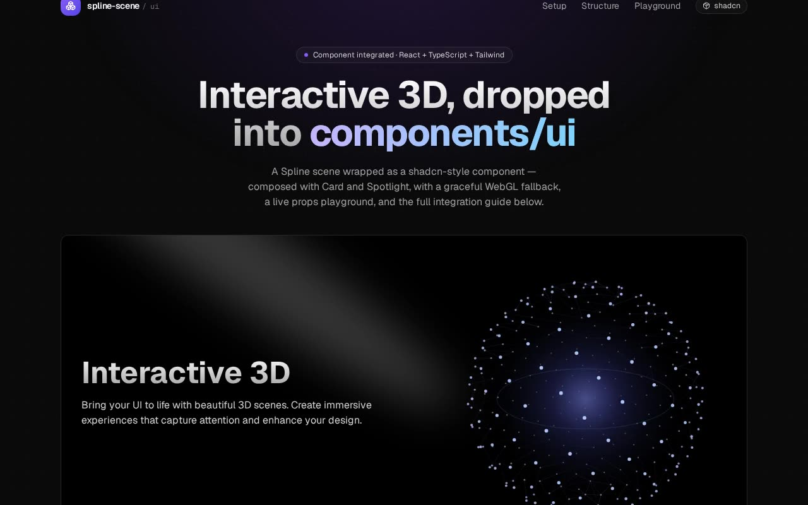

# Interactive 3D Spline Scene — Hero Card Component (React + shadcn/ui + Spline + Framer Motion)

[](./demo.mp4)

A split hero card that pairs gradient-clipped marketing copy on the left with a lazily-loaded, interactive Spline 3D scene on the right, set on a near-black card surface with an Aceternity-style sweeping spotlight effect. The `SplineScene` component wraps `@splinetool/react-spline` in `Suspense` with a spinner fallback and lazy-imports the runtime so the heavy 3D bundle only loads when needed. Combines a shadcn `Card`, an inline-SVG `Spotlight` with Gaussian blur, and the embedded Spline scene — ready to drop into any shadcn/ui + Tailwind CSS + TypeScript project. Generated with Claude Fable 5.

## Run

```sh
npm install
npm run dev       # dev server
npm run build     # production build
npm run preview   # serve the build
npm run lint      # type-check
npm run verify    # project verification script
```

See `prompt.md` for the full build spec; `demo.mp4` shows it in motion.

---

Part of the [Components & UI](../) collection in the [claude-directory](../../) — an open-source gallery of AI-generated UI built with Claude Fable 5. [Browse the live gallery](https://pulkitxm.com/claude-directory).
