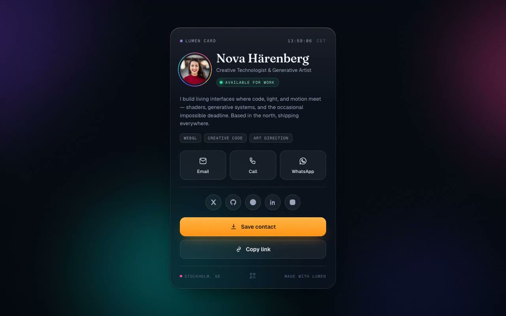

# Lumen Aurora — Cinematic Personal Digital Visiting Card (Vanilla HTML + CSS + JS)

[](./demo.mp4)

A single-page, mobile-first personal vCard for Nova Härenberg ("Creative Technologist & Generative Artist"): one tactile frosted-glass card floats over a slow drifting aurora of violet, cyan, magenta, and indigo blobs, stacking an avatar/name/role hero with a live "available" status dot, a short bio with mono tag chips, a three-up quick-actions grid (email/call/WhatsApp), a social-link row, a "Save Contact" vCard 3.0 download generated entirely in-browser, and a footer with location and a ticking local clock. Desktop pointer parallax tilts the card toward the cursor and tracks a specular highlight across the glass. All fonts (Fraunces display serif, Geist, Geist Mono) and assets are vendored locally — no runtime network calls. Built as a self-contained static site (`index.html` + `styles.css` + vanilla `script.js`, no build step). Generated with Claude Fable 5.

## Run

This is a static project — open `index.html` in a browser, or serve the folder:

```sh
python3 -m http.server 8000
```

See `prompt.md` for the full build spec; `demo.mp4` shows it in motion.

---

Part of the [Components & UI](../) collection in the [claude-directory](../../) — an open-source gallery of AI-generated UI built with Claude Fable 5. [Browse the live gallery](https://pulkitxm.com/claude-directory).
