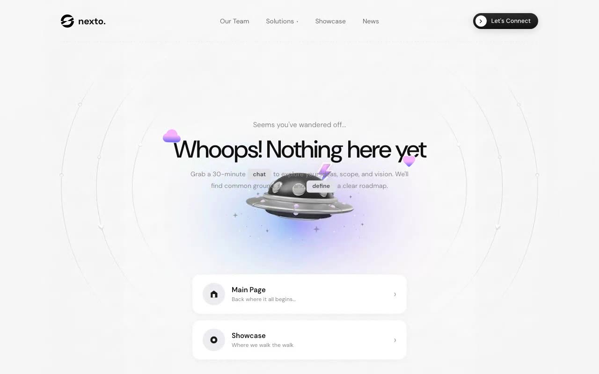

# Nexto 404 Hero — Full-Viewport "Page Not Found" Page (React + Vite + Tailwind CSS)

[](./demo.mp4)

A full-viewport 404 "Page Not Found" hero page for the fictional **nexto.** brand, featuring a layered alien-spaceship PNG over a soft gradient background, floating gradient Material Symbols icons, bottom-pinned navigation cards, and a hamburger-to-X mobile overlay — all locked to `100vh` with zero scroll. The visual style pairs DM Sans variable font with gradient-clipped icon decorations and a dashed-gradient navbar border. Use case: branded error pages and empty-state landing views. Generated with Claude Fable 5.

## Highlights

- Layered fixed background: alien-spaceship PNG over a soft `to top left` gradient
- Navbar with dashed gradient bottom border, centered links and a gradient
  pill CTA with a circular chevron badge
- Hero title flanked by floating gradient-filled `cloud` / `favorite`
  Material Symbols (`floatSlow` animation, staggered delays)
- Inline highlight tags (`chat`, `define`) in the subtext
- Bottom-pinned navigation cards (Main Page / Showcase) with hover lift,
  icon scale and sliding chevron
- Mobile: hamburger → X morph, full-screen overlay sliding in with
  `cubic-bezier(0.77, 0, 0.175, 1)`, 38px/800 left-aligned links
- Breakpoints at 768px and 480px per spec

## Run

```bash
npm install
npm run dev      # dev server
npm run build    # type-check + production build
npm run preview  # serve the production build
```

---

Part of the [Components & UI](../) collection in the [claude-directory](../../) — an open-source gallery of AI-generated UI built with Claude Fable 5. [Browse the live gallery](https://pulkitxm.com/claude-directory).
