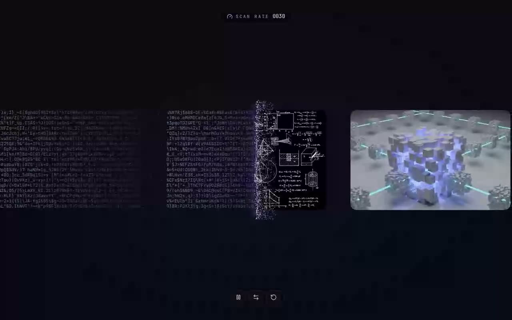

# Scanner Card Stream — Draggable Infinite WebGL Card Stream with ASCII Scan Effect (React + Three.js + Tailwind CSS v4)

[](./demo.mp4)

A draggable, infinitely-looping Three.js card stream component where each card glides toward a glowing violet scan line at the center of the viewport — as it crosses, the photo clips away and the card "decodes" into a wall of glitching, scrambling ASCII. An ambient WebGL particle field drifts behind the cards, and a 2D spark field erupts from the scan line whenever a card is under it. Structured as a shadcn-style drop-in component (`src/components/ui/scanner-card-stream.tsx`) for React + Tailwind CSS v4 + TypeScript projects. Generated with Claude Fable 5.

## Run it

```bash
npm install
npm run dev       # http://localhost:5173
npm run build     # tsc --noEmit + vite build
npm run verify    # headless Playwright checks against `npm run preview`
```

## Props

| Prop           | Type                      | Default            | Notes                                                    |
| -------------- | ------------------------- | ------------------ | -------------------------------------------------------- |
| `showControls` | `boolean`                 | `false`            | Play/pause, reverse, reset buttons (lucide-react icons). |
| `showSpeed`    | `boolean`                 | `false`            | Live "scan rate" gauge.                                  |
| `initialSpeed` | `number`                  | `150`              | Starting stream velocity (px/s).                         |
| `direction`    | `-1 \| 1`                 | `-1`               | `-1` flows left, `1` flows right.                        |
| `cardImages`   | `string[]`                | 5 vendored images  | Any image URLs/paths.                                    |
| `repeat`       | `number`                  | `6`                | How many times the image set is tiled into the loop.     |
| `cardGap`      | `number`                  | `60`               | Gap between cards (px).                                   |
| `friction`     | `number`                  | `0.95`             | Per-frame velocity decay after a flick.                  |
| `scanEffect`   | `'clip' \| 'scramble'`    | `'scramble'`       | `scramble` re-randomizes the ASCII as it's scanned.      |

**Interaction:** drag/flick the stream to scrub with momentum, or scroll the wheel to push it.

## Integration notes (answering the prompt)

This repo **already satisfies** the required stack, so no scaffolding was needed:

- **TypeScript** — `tsconfig.json`, `.tsx` sources.
- **Tailwind CSS v4** — via the `@tailwindcss/vite` plugin; styles in `src/index.css` with `@import "tailwindcss"`.
- **shadcn-style structure** — components under `src/components/ui`, imported through the `@` path alias.

### Why `/components/ui`

shadcn/ui's convention puts every primitive in `components/ui`. It matters because:

1. The shadcn CLI (`npx shadcn@latest add ...`) writes generated components there by default — keeping to it means CLI-added primitives and hand-written ones live side by side.
2. The `@/components/ui/...` import alias (set in `components.json` / `tsconfig` `paths`) resolves to that exact folder, so imports stay stable and predictable.
3. It separates reusable, presentational **UI primitives** (`components/ui`) from feature/composed components, which keeps the tree legible as it grows.

### If your project does NOT have the stack yet

```bash
# 1) Vite + React + TS
npm create vite@latest my-app -- --template react-ts && cd my-app

# 2) Tailwind v4
npm install tailwindcss @tailwindcss/vite
#   add the plugin to vite.config.ts and `@import "tailwindcss";` to your CSS

# 3) shadcn — sets up components.json, the @ alias, and components/ui
npx shadcn@latest init
#   then drop scanner-card-stream.tsx into src/components/ui/

# 4) Component dependencies
npm install three lucide-react
npm install -D @types/three
```

## The 5 prompt questions

- **What props get passed?** See the table above; `App.tsx` enables `showControls` + `showSpeed`.
- **State management?** None external — local `useState` for speed/pause/scanning plus `useRef` for the imperative animation/physics loop. No context provider required.
- **Required assets?** Card images. The prompt's defaults hotlinked a Webflow CDN; per this repo's offline-first rule they're **vendored locally** in `public/assets/cards/` (5 Unsplash photos). Icons come from `lucide-react`.
- **Responsive behavior?** Full-viewport (`w-screen h-screen`); the canvases, camera and scan line recompute on `resize`. The stream is horizontal and content-agnostic, so it adapts to any width.
- **Best place to use it?** A hero / landing band, a loading or "processing" interstitial, or a showcase strip — anywhere a full-bleed, motion-forward moment fits.

## What changed from the pasted source

The pasted component was a scaffold with stubbed-out internals. To make it actually run:

- **`<style jsx global>` → `src/index.css`.** `styled-jsx` is Next-only; the `glitch` / `scanPulse` keyframes moved into the Tailwind stylesheet.
- **Filled the empty handlers** (`handleMouseDown/Move/Up`, `handleWheel`) so drag-to-scrub, flick momentum, and wheel pushing work.
- **Filled the empty cleanup** — cancels the RAF, clears scramble intervals, removes listeners, disposes the geometry/material/texture/renderer.
- **Added the controls + speed UI** (commented out in the source) using `lucide-react` icons.
- **Added a `resize` handler** so the WebGL/2D canvases and orthographic camera stay correct.
- **Vendored images locally** instead of hotlinking the CDN.

## Stack

React 18, TypeScript, Vite 6, Tailwind CSS v4, Three.js, lucide-react.

---

Part of the [Components & UI](../) collection in the [claude-directory](../../) — an open-source gallery of AI-generated UI built with Claude Fable 5. [Browse the live gallery](https://pulkitxm.com/claude-directory).
