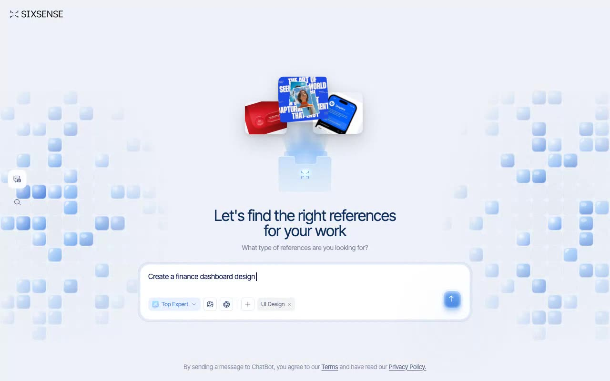

# Sixsense Reference Finder — Glassy AI Reference-Finder UI (React + Vite + Framer Motion + Tailwind CSS)

[](./demo.mp4)

A pixel-faithful recreation of the Sixsense "Let's find the right references for your work" page — a glassy AI reference-finder interface built on React + Vite + TypeScript + Tailwind CSS (shadcn-ui base) with Framer Motion and lucide-react. The design pairs animated canvas pixel-grid backgrounds, layered SVG folder/light stacks, floating reference cards with spring physics, and a glass prompt box with an infinite typewriter and a spinning conic-gradient send button. Use case: AI-powered creative research tools and prompt-input landing pages. Generated with Claude Fable 5.

## What's in it

- **Canvas pixel-grid backgrounds** (left + right) of rounded blue glass tiles.
  Sprites are rasterized once at `devicePixelRatio` (capped at 2) via a
  module-level promise cache. Each grid runs a mount reveal (chunked per rAF),
  an indefinite ambient flicker, and a window-level **organic hover blob** with
  sine-wobbled radius + deterministic edge noise and per-frame hover flicker.
  Honors `prefers-reduced-motion` (paints the final base state only).
- **Folder / lights stack** — ten layered SVGs (folders, blue lights, glow
  lights) with staggered framer-motion entrances.
- **Three floating reference cards** that grow from a 20px seed above the folder
  into their fanned-out final positions, then float on infinite y/rotate loops;
  hovering one scales it and freezes all three.
- **Glass prompt box** with an infinite typewriter (5 phrases, randomized typing
  cadence, blinking caret), a toolbar (Top Expert pill, icon buttons, tag), and
  a **gradient send button** with an rAF-eased spinning conic ring, a dots
  overlay, a once-per-hover shine sweep, and a swapping arrow icon.
- Navbar logo, left sidebar (chat + search), and the footer disclaimer.

## Assets

Every remote asset listed in the spec (`https://qclay.design/lovable/sixsense/…`)
is **vendored locally** under `public/qclay/` so the project runs fully offline;
the page references them through `const A = "/qclay"`. The blue glass tiles live
in `public/tiles/`, and **Inter Tight** is self-hosted from
`public/fonts/inter-tight-latin.woff2`.

## Run

```bash
npm install
npm run dev       # dev server
npm run build     # type-check + production build
npm run preview   # serve the production build
npm run verify    # headless Playwright checks against the preview server
```

---

Part of the [Components & UI](../) collection in the [claude-directory](../../) — an open-source gallery of AI-generated UI built with Claude Fable 5. [Browse the live gallery](https://pulkitxm.com/claude-directory).
