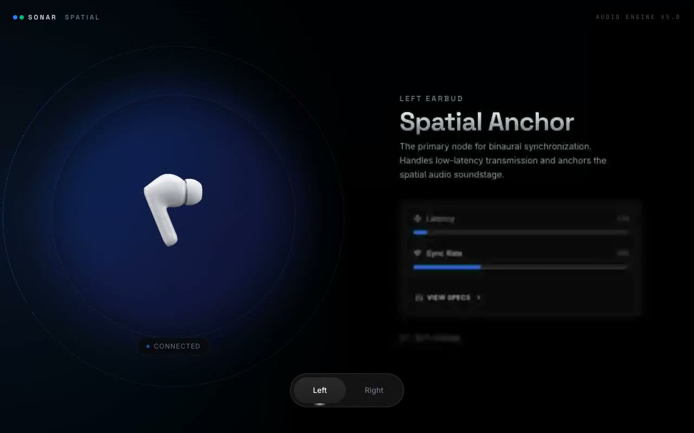

# Spatial Product Showcase — Animated Earbud Product Showcase (React + Framer Motion + Tailwind CSS)

[](./demo.mp4)

An animated earbud product showcase component that switches between a "Left" and "Right" earbud via a floating, Dynamic-Island-style pill switcher. Selecting a side morphs the whole layout — the visual mirrors to the opposite side, the radial background gradient shifts, and the content (title, description, animated feature bars, battery, status) re-renders with spring transitions. Animation is driven by Framer Motion: `AnimatePresence` for image/content swaps, `layout`/`layoutId` for the morphing layout and shared switcher surface, orbiting dashed rings, a breathing glow, a floating image bob, and width-animated feature meters with staggered delays. Use case: interactive product detail pages and dark-mode consumer electronics showcases. Generated with Claude Fable 5.

## Run

```sh
npm install
npm run dev       # dev server
npm run build     # production build
npm run preview   # serve the build
npm run verify    # project verification script
```

See `prompt.md` for the full build spec; `demo.mp4` shows it in motion.

---

Part of the [Components & UI](../) collection in the [claude-directory](../../) — an open-source gallery of AI-generated UI built with Claude Fable 5. [Browse the live gallery](https://pulkitxm.com/claude-directory).
