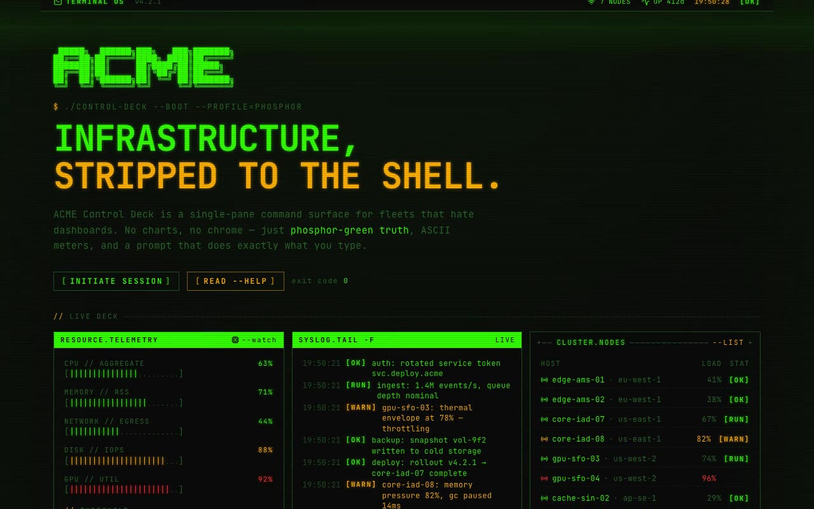

# Terminal CLI Control Deck — Phosphor-Green Infrastructure Dashboard (React + Vite + Tailwind CSS)

[](./demo.mp4)

`ACME CONTROL DECK // TERMINAL OS` — a single-pane infrastructure control panel rendered entirely in the Terminal CLI design system: phosphor-green on near-black, monospace everywhere, zero rounded corners, and a subtle CRT scanline overlay. The design system is centralized (tokens in `@theme` + composable primitives under `src/design-system/`) and a real product surface is composed from those primitives. Features an interactive zsh console, real-time ASCII meters, a self-driving syslog feed, and a box-less access form — ideal for developer tools, admin dashboards, and retro-hacker UI showcases. Generated with Claude Fable 5.

## What's in it

- **ASCII-art wordmark** + a character-by-character **typewriter** headline.
- **tmux-style grid of windows/panes**, each a black box with a 1px green
  border and an inverted (or `+--- ASCII ---+`) title bar.
- **Raw-data ASCII meters** `[|||||||.....]` that auto-escalate
  `nominal → warn(≥75) → crit(≥90)` (green → amber → red).
- A **self-driving syslog feed** (`tail -f`) and a fully **interactive zsh
  console** — type `help`, `status`, `scan`, `deploy <env>`, `whoami`, `clear`.
- A box-less **access form** with shell-prompt inputs, a blinking block caret
  `█`, and live `[OK] / [ERR]` validation.
- **CRT effects**: fixed scanlines, a travelling sweep, screen flicker, glow,
  and a glitch-on-hover session id.
- Fully **responsive** — windows stack to a single column on mobile.

## Design system

| Token | Value |
|-------|-------|
| Background | `#0a0a0a` |
| Primary (green) | `#33ff00` |
| Secondary (amber) | `#ffb000` |
| Muted / border | `#1f521f` |
| Error | `#ff3333` |
| Radius | `0px` |
| Font | JetBrains Mono + VT323 (vendored locally) |

Primitives: `Window`, `BracketButton`, `PromptInput`, `AsciiBar`,
`StatusBadge`, `Typewriter`, `Cursor`, `Glitch`, `Divider`, `CrtOverlay`.

## Assets

Fonts (`JetBrains Mono` 400/700, `VT323` 400) are **vendored locally** under
`src/assets/fonts/*.woff2` and bundled by Vite — the project runs fully offline,
no CDN or remote font calls.

## Run

```bash
npm install
npm run dev       # dev server
npm run build     # type-check + production build
npm run preview   # serve the production build on :4173
npm run verify    # headless Playwright checks against the preview server
```

`npm run verify` boots nothing itself — start `npm run preview` first, then run
`node scripts/verify.mjs http://localhost:4173`.

---

Part of the [Components & UI](../) collection in the [claude-directory](../../) — an open-source gallery of AI-generated UI built with Claude Fable 5. [Browse the live gallery](https://pulkitxm.com/claude-directory).
