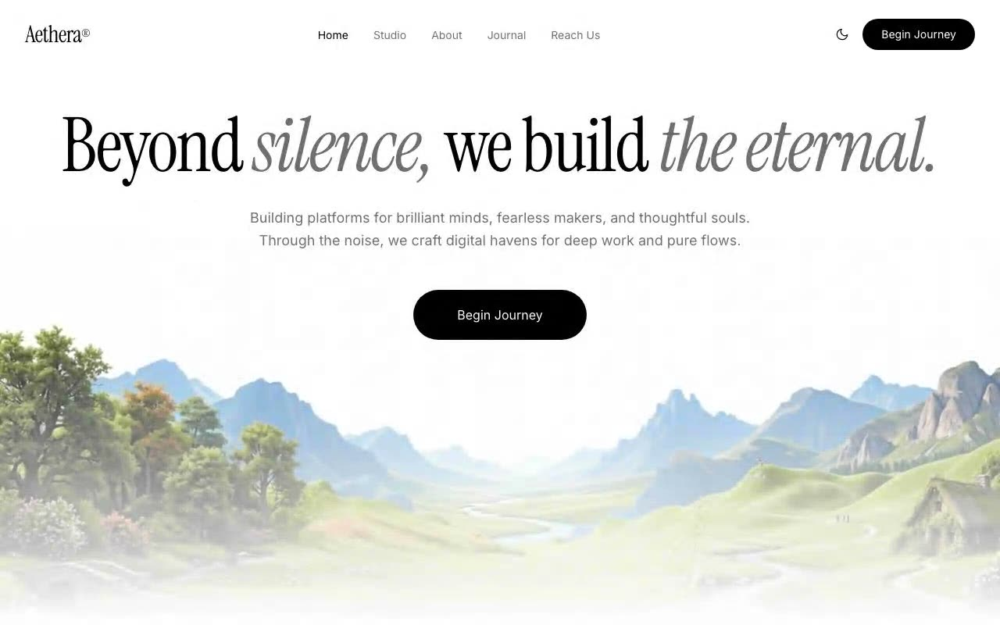

# Aethera — Cinematic Video Hero Section (React + Vite + Tailwind CSS v4)

[](./demo.mp4)

Fullscreen single-page hero section for the fictional studio brand "Aethera," pairing a monochrome editorial layout with a looping background video that custom-fades in and out at each playthrough. Features a glassmorphic navigation bar, Instrument Serif editorial headline with italicized emphasis, staggered `fade-rise` entrance animations, and a light/dark mode toggle that swaps three CSS palette tokens to invert the whole page with a 0.5s transition. Ideal as a cinematic landing page or creative studio hero. Generated with Claude Fable 5.

## Dark mode

A navbar toggle flips light/dark. Every surface paints from three palette
tokens (`--color-background`/`--color-ink`/`--color-muted`), so dark mode is
just an override of those tokens under `html.dark` in `src/styles/theme.css` —
one swap inverts the whole page, eased by a 0.5s color transition. The initial
theme is applied before first paint by an inline script in `index.html`
(stored choice in `localStorage`, falling back to the OS `prefers-color-scheme`),
so there's no flash.

## Run

```sh
npm install
npm run dev       # dev server
npm run build     # type-check + production build
npm run preview   # serve the production build
```

## Verify

A headless Playwright suite asserts every visual and behavioral spec
(fonts, colors, spacing, animations, video fade-loop lifecycle,
responsiveness) against the production build:

```sh
npm run build
node scripts/verify.mjs
```

Screenshots from the latest run are in `screenshots/` (`desktop-1440.png` light,
`dark-1440.png` dark, `mobile-390.png`).

## Demo recording

This project ships its own recorder (instead of the shared
`scripts/record-demos`) so `demo.mp4` shows the theme switch: hold light →
toggle dark → dwell → toggle back. Requires ffmpeg on `PATH`.

```sh
npm run build
node scripts/record-demo.mjs   # writes demo.mp4
```

---

Part of the [Hero sections](../) collection in the [claude-directory](../../) — an open-source gallery of AI-generated UI built with Claude Fable 5. [Browse the live gallery](https://pulkitxm.com/claude-directory).
