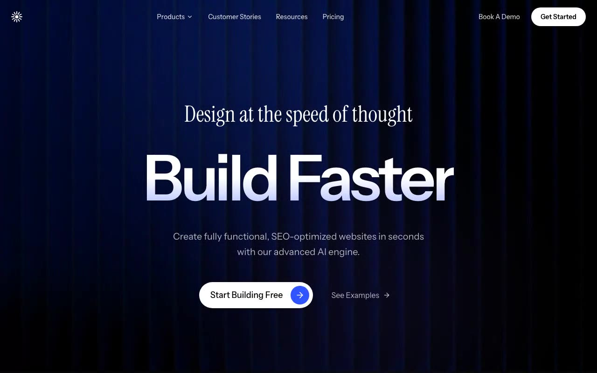

# AI Builder Dark Hero — Dark-Mode AI Website Builder Hero Section (React + Vite + HLS.js + Motion)

[](./demo.mp4)

Dark-mode hero section for an AI website builder, pairing a full-bleed HLS background video (streamed via Mux with hls.js and a Safari native fallback) with a black overlay, soft decorative gradient glows, gradient-clipped headline, and centered Motion-animated copy. A fixed transparent navbar sits on top; the hero closes with a primary pill CTA and a secondary text-link. Uses Instrument Sans + Instrument Serif typography and Tailwind CSS v4. Generated with Claude Fable 5.

## Stack

- Vite + React 19 + TypeScript
- Tailwind CSS v4 (`@tailwindcss/vite`)
- `motion` (animations), `hls.js` (video streaming), `lucide-react` (icons)

## Run

```sh
npm install
npm run dev      # dev server
npm run build    # type-check + production build
npm run verify   # headless Playwright checks against the production build
```

`npm run verify` boots `vite preview`, asserts every observable prompt
requirement (layout, fonts, gradient text, animation end-states, HLS playback,
overlays), and saves desktop + mobile screenshots to `screenshots/`.

---

Part of the [Hero sections](../) collection in the [claude-directory](../../) — an open-source gallery of AI-generated UI built with Claude Fable 5. [Browse the live gallery](https://pulkitxm.com/claude-directory).
