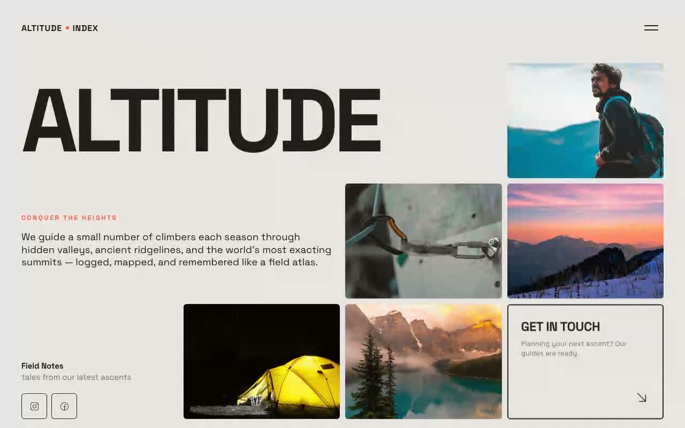

# Altitude Index — Editorial Expedition Bento Hero (Vanilla JS + CSS + HTML)

[](./demo.mp4)

A full-viewport hero section for a fictional high-altitude expedition outfitter built in the "Warm Cartography" design language — the opening spread of a printed expedition field guide. A warm paper-stock background (`#E8E5E2`), ink-black Space Grotesk display type clamped from 56px to 184px, and a single ember-orange accent (`#FE5733`) carry a precise 4-column / 3-row bento grid of photo tiles and text panels. Notable techniques: staggered on-load cell reveals via Intersection Observer, RAF-throttled pointer parallax that drifts photo tiles opposite the cursor, a continuous CSS marquee coordinate ticker with hover-pause, and a full-screen ink overlay menu that slides up from the bottom. All motion respects `prefers-reduced-motion`. No build step — all assets are vendored locally. Generated with Claude Fable 5.

## Run

This is a static project — open `index.html` in a browser, or serve the folder:

```sh
python3 -m http.server 8000
```

See `prompt.md` for the full build spec; `demo.mp4` shows it in motion.

---

Part of the [Hero sections](../) collection in the [claude-directory](../../) — an open-source gallery of AI-generated UI built with Claude Fable 5. [Browse the live gallery](https://pulkitxm.com/claude-directory).
