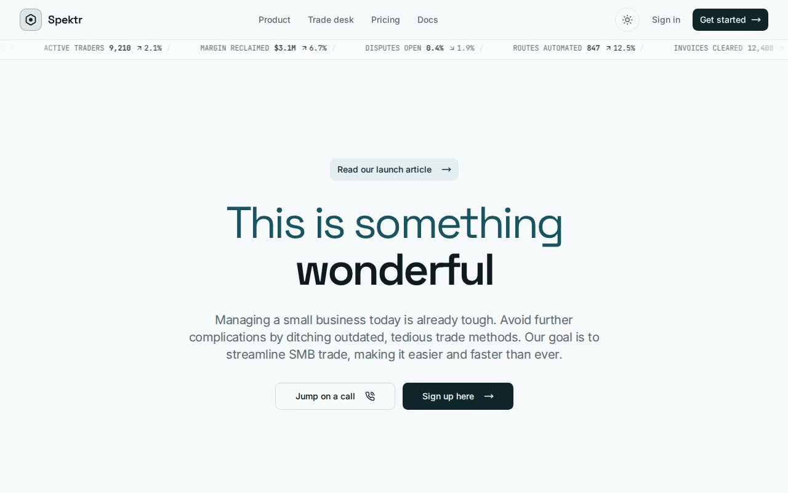
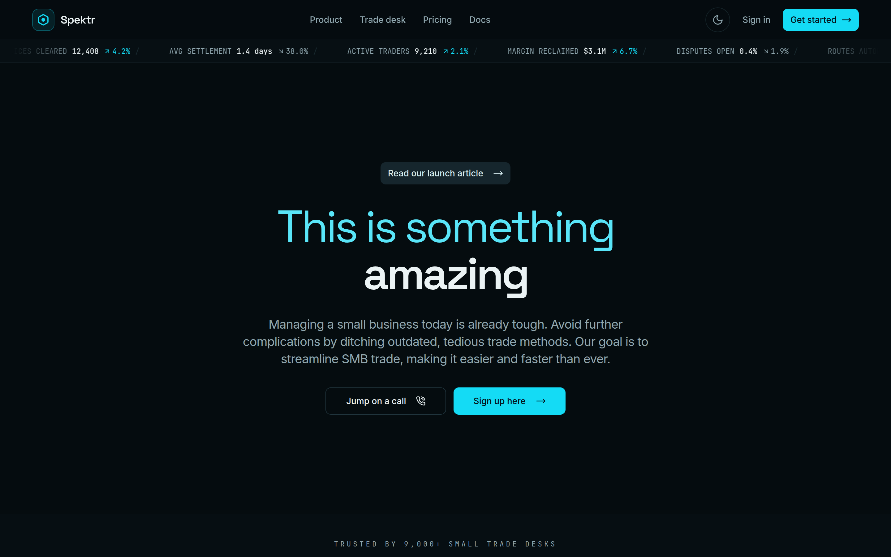

# Animated Text Rotate Hero — shadcn/ui Rotating Headline Component (React + Tailwind + TypeScript + Framer Motion)

[](./demo.mp4)

A centered marketing hero section that integrates the **shadcn/ui animated hero** — a headline that swaps a rotating word every two seconds using a `framer-motion` spring (`amazing → new → wonderful → beautiful → smart`). The component is embedded inside a branded **"Spektr" trade-desk** shell (midnight-teal identity, self-hosted fonts, live ticker tape) so you can see it in realistic landing-page context. Fully accessible: ambient motion freezes under `prefers-reduced-motion`, focus rings are visible, and zero remote assets are fetched at runtime. Generated with Claude Fable 5.



---

## Does the codebase support shadcn / Tailwind / TypeScript?

Yes — this folder **is** a complete shadcn-style project, so the component runs
as-is. The pieces that make it a valid shadcn project:

| Requirement | Where it lives |
| --- | --- |
| shadcn project structure | `components.json`, `src/components/ui/`, `src/lib/utils.ts` |
| Tailwind CSS | `tailwind.config.ts`, `postcss.config.js`, `src/index.css` (tokens) |
| TypeScript | `tsconfig.json` (with the `@/*` path alias) |
| `@` import alias | `vite.config.ts` **and** `tsconfig.json` (both required) |

### If you are starting from scratch instead

```bash
# 1. Scaffold a Vite + React + TypeScript app
npm create vite@latest my-app -- --template react-ts
cd my-app

# 2. Add Tailwind (v3) + PostCSS
npm install -D tailwindcss@3 postcss autoprefixer
npx tailwindcss init -p

# 3. Add the "@" path alias so shadcn imports resolve.
#    tsconfig.json  -> compilerOptions.baseUrl "." and paths { "@/*": ["./src/*"] }
#    vite.config.ts -> resolve.alias { "@": path.resolve(__dirname, "./src") }

# 4. Initialise shadcn/ui and add the only registry dependency this hero needs
npx shadcn@latest init
npx shadcn@latest add button
```

---

## Default path for components & styles, and why `/components/ui` matters

`components.json` pins the defaults the shadcn CLI uses:

```jsonc
"aliases": {
  "components": "@/components",
  "ui":         "@/components/ui",   // <- every primitive lands here
  "utils":      "@/lib/utils"
},
"tailwind": { "css": "src/index.css", "config": "tailwind.config.ts" }
```

So **components** default to `src/components/ui` and **styles** live in
`src/index.css`. This project already uses `/components/ui`, but it is worth
keeping even when it is not the framework default, because:

- **The CLI writes there.** `npx shadcn add <x>` drops primitives into the
  `ui` alias. If the folder is missing or renamed, generated files and the
  imports inside them (`@/components/ui/button`) stop lining up.
- **The copied code imports from it.** `animated-hero.tsx` and `demo.tsx` both
  do `import { Button } from "@/components/ui/button"`. The path has to exist
  verbatim or the build fails to resolve.
- **It separates vendor primitives from your app.** `ui/` holds the
  shadcn-owned, regenerable building blocks; everything you author by hand
  (here: `Navbar`, `TradeTicker`, `Footer`, …) sits one level up in
  `components/`. That boundary keeps re-runs of the CLI from clobbering your
  own work.

---

## Implementation notes (the questions the brief asks)

**What data / props does the hero take?** None — `Hero` takes no props. The
rotating words live in a local `useMemo` array and the copy is hard-coded. To
customise, edit the `titles` array or the headline/paragraph text directly in
`src/components/ui/animated-hero.tsx`.

**State management?** Local only. One `useState` (`titleNumber`) drives the
index; a `useEffect` + `setTimeout` advances it every 2000 ms and is cleaned up
on unmount. No context, store, or provider is required.

**Required context providers / hooks?** None for the hero. The surrounding demo
adds a tiny client-side theme toggle (`ThemeToggle`) that flips the `.dark`
class — that is app chrome, not a dependency of the component.

**Required assets (images / icons)?** No images. The hero is typography + two
`lucide-react` icons (`MoveRight`, `PhoneCall`). Because nothing in this
component calls for a photograph, **no Unsplash stock images are used** — adding
any would be decoration the brief does not need. The demo's wordmark and
customer "logos" are likewise built from `lucide-react` icons, so the project
ships with **zero remote assets** and runs fully offline.

**Responsive behaviour.** Mobile-first. The headline scales `text-5xl →
md:text-7xl`, content is centered and width-capped at `max-w-2xl`, and the CTA
row stays horizontal. The shell's nav links collapse below `md` while the CTAs
remain. Verified at 1440px and 390px (see `screenshots/`).

**Best place to use it.** The above-the-fold section of a landing / marketing
page — exactly how `src/App.tsx` mounts it: sticky nav + ticker, then `<Hero />`
over an ambient background, then social proof.

---

## Design

A midnight-teal **trade terminal** identity (the product streamlines *SMB
trade*), so the chrome speaks that world rather than reaching for a generic dark
hero:

- **Palette** — ink `#05080a` canvas, brand cyan `#22d3ee` accent (wired to the
  component's own `text-spektr-cyan-50` token), cool foreground. Light and dark
  are both first-class via shadcn CSS variables.
- **Type** — `Space Grotesk` display, `Inter` body, `JetBrains Mono` for the
  ticker and eyebrow labels. All three are **self-hosted** woff2 in
  `public/fonts/` — no Google Fonts request at runtime.
- **Signature** — a live "trade desk" ticker tape (`TradeTicker`) of SMB metrics
  that encodes the subject instead of decorating it, plus a slow cyan aurora and
  an engineered dot-grid behind the hero.
- **Quality floor** — visible keyboard focus rings (shadcn `ring`), and all
  ambient + rotation motion is frozen under `prefers-reduced-motion`.

---

## Run

```bash
npm install
npm run dev        # http://localhost:5173

npm run build      # tsc --noEmit + vite build
npm run preview    # serve the production build
```

### Verify (headless, CLI-only)

```bash
npm run preview &  # serve on a port, e.g. 5188
CHROME_BIN=/path/to/chrome VERIFY_URL=http://localhost:5188/ node scripts/verify.mjs
```

`scripts/verify.mjs` asserts the headline + all five rotating words render, the
word actually advances over time, every CTA is present, the local display font
is applied, the theme toggle flips both ways, and there are **no external
requests and no console errors**.

## Files

| Path | Purpose |
| --- | --- |
| `src/components/ui/animated-hero.tsx` | The integrated component (verbatim) |
| `src/components/ui/demo.tsx` | The provided demo wrapper (verbatim) |
| `src/components/ui/button.tsx` | shadcn Button dependency (verbatim) |
| `src/lib/utils.ts` | `cn()` class-merge helper |
| `src/App.tsx` | Branded demo host for the hero |
| `src/components/*` | Shell: navbar, ticker, background, trust strip, footer |
| `tailwind.config.ts` · `src/index.css` | shadcn token theme (light + dark) |
| `components.json` | shadcn CLI config |

---

Part of the [Hero sections](../) collection in the [claude-directory](../../) — an open-source gallery of AI-generated UI built with Claude Fable 5. [Browse the live gallery](https://pulkitxm.com/claude-directory).
