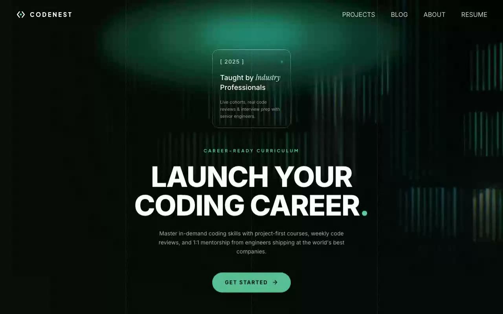

# CodeNest — Cinematic Dark Hero Section (React + TypeScript + Tailwind CSS + hls.js)

[](./demo.mp4)

High-end, dark-themed hero section for the fictional coding education platform **CodeNest**. A full-screen Mux HLS background video plays at 60% opacity under layered left and bottom `#070b0a` gradients, while a 200×200px liquid glass card (luminosity blend, 4px backdrop blur, 1.4px XOR-masked gradient border) floats 50px above a bold uppercase headline. Desktop grid lines and an SVG ellipse glow in cyan/dark-green complete the cinematic atmosphere. Includes a functional mobile hamburger menu with a full-screen dark overlay. Generated with Claude Fable 5.

## Run

```bash
npm install
npm run dev        # local dev server
npm run build      # typecheck + production build
npm test           # vitest unit/DOM tests
npm run preview    # serve the production build
npm run verify     # headless Playwright spec verification (needs preview server)
```

---

Part of the [Hero sections](../) collection in the [claude-directory](../../) — an open-source gallery of AI-generated UI built with Claude Fable 5. [Browse the live gallery](https://pulkitxm.com/claude-directory).
