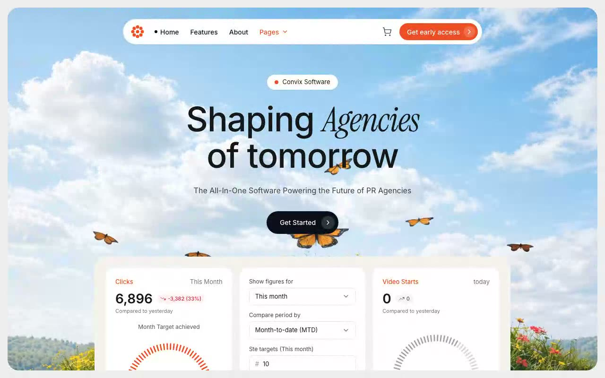

# Convix PR Agency Hero — Full-Viewport SaaS Hero Section (React + TypeScript + Tailwind CSS)

[](./demo.mp4)

Full-viewport hero section for **Convix Software**, a PR-agency SaaS platform. A looping background video sits inside a rounded, clipped hero shell on a light gray page frame. On top: a floating white pill navbar (8-petal flower logo, hamburger under `md`), a centered headline mixing Inter with italic Instrument Serif, and a three-card analytics dashboard preview (tick-mark gauges, settings form) that bleeds off the clipped bottom edge. All three dashboard columns step down to 1 → 2 → 3 columns across breakpoints. Generated with Claude Fable 5.

## Stack

- React 18 + TypeScript + Vite
- Tailwind CSS 3
- lucide-react icons
- Inter + Instrument Serif (Google Fonts)

## Run

```sh
npm install
npm run dev
```

## Verify (CLI / headless)

```sh
npm run build
npm run preview &
npm run verify   # Playwright checks across desktop / tablet / mobile viewports
```

---

Part of the [Hero sections](../) collection in the [claude-directory](../../) — an open-source gallery of AI-generated UI built with Claude Fable 5. [Browse the live gallery](https://pulkitxm.com/claude-directory).
