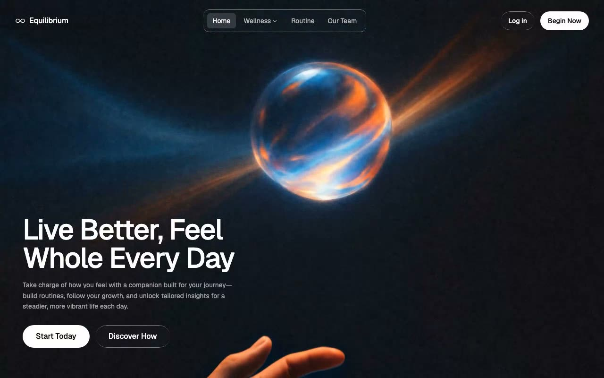

# Equilibrium — Liquid Glass Wellness Hero Section (React + Vite + Tailwind CSS)

[](./demo.mp4)

A full-screen, single-viewport hero section for a wellness brand featuring a looping background video overlaid with a "liquid glass" frosted UI. The design uses `backdrop-filter: blur` with gradient-border pseudo-elements to create a premium glassmorphism aesthetic — a floating navbar pill, glassy CTA buttons, and a bottom-left headline block over cinematic video. Built with React 18, TypeScript, Vite, and Tailwind CSS 3, using the Geist typeface from Google Fonts. Generated with Claude Fable 5.

## Run

```sh
npm install
npm run dev      # start the Vite dev server
npm run build    # type-check (tsc) and build for production
npm run preview  # preview the production build
```

See `prompt.md` for the full build spec; `demo.mp4` shows it in motion.

---

Part of the [Hero sections](../) collection in the [claude-directory](../../) — an open-source gallery of AI-generated UI built with Claude Fable 5. [Browse the live gallery](https://pulkitxm.com/claude-directory).
