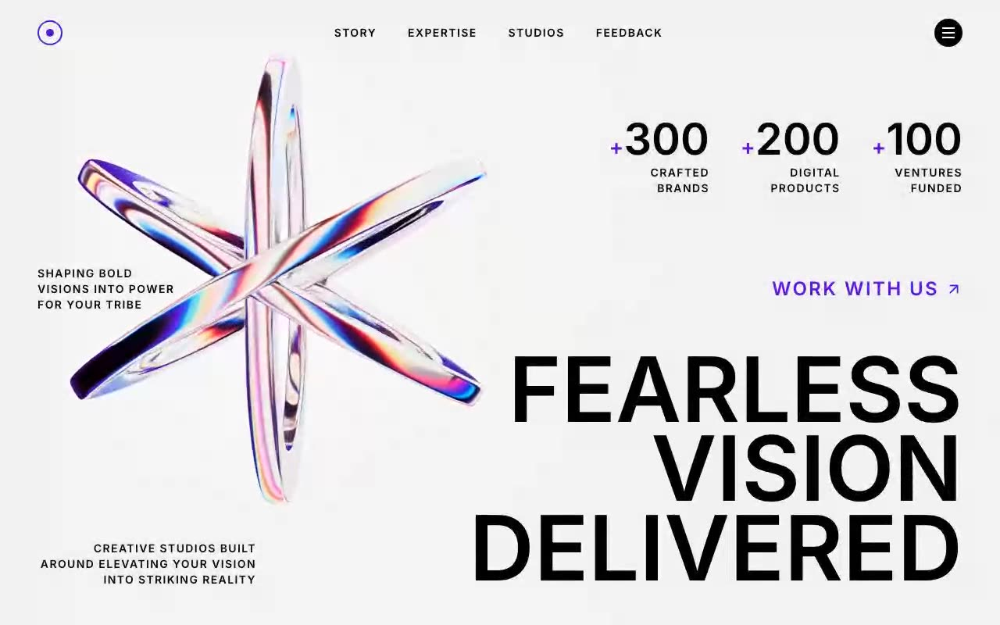

# Fearless Vision Hero — Cinematic Full-Screen Video Hero Section (React + Framer Motion + Tailwind CSS)

[](./demo.mp4)

A full-screen, video-background hero section for a creative studio — "Fearless / Vision / Delivered" — with staggered Framer Motion entrance animations, a three-tier responsive layout, and a giant fluid-type heading that reveals character-by-character via a clip-reveal slide-up effect. The design uses uppercase Inter 600 throughout with a deep-purple accent (`#5E0ED7`), a right-aligned stats row, and a full-screen white mobile menu overlay with Escape-to-close and body scroll lock. Built with React 18, Vite, Tailwind CSS 3, and Framer Motion. Generated with Claude Fable 5.

## Stack

- React 18 + Vite
- Tailwind CSS 3
- Framer Motion (staggered fadeDown / fadeUp variants + clip-reveal heading)
- Lucide React (`ArrowUpRight`, `X`)
- Inter (600) — uppercase, wide tracking throughout

## Highlights

- Autoplaying, looping, muted background video (`absolute inset-0 object-cover`)
- Three-tier responsive layout (mobile / `sm:` 640px / `md:` 768px)
- Right-aligned stats row with accent `+` glyphs (`#5E0ED7`)
- Giant clamped heading (`clamp(2rem, 9vw, 9rem)`, line-height 0.88) with per-word slide-up reveals
- Full-screen white mobile menu overlay with staggered link entrances, Escape-to-close, and body scroll lock

## Run

```bash
npm install
npm run dev      # dev server
npm run build    # production build
npm run preview  # serve the build
```

---

Part of the [Hero sections](../) collection in the [claude-directory](../../) — an open-source gallery of AI-generated UI built with Claude Fable 5. [Browse the live gallery](https://pulkitxm.com/claude-directory).
