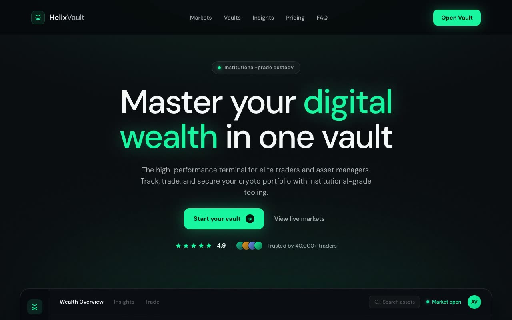

# Helix Vault — Institutional Crypto Terminal Hero Section (Vanilla HTML + CSS + JS)

[](./demo.mp4)

An above-the-fold hero section for a fictional high-performance crypto portfolio platform called Helix Vault, rendered in an "Institutional Crypto Terminal" aesthetic: a deep near-black trading-floor canvas (`#07080C`) lit by a single blade of emerald light (`#19F5A0`), with an oversized editorial headline floating above a hyper-detailed glass-panelled portfolio dashboard mockup. The mood is a Bloomberg terminal reimagined as a luxury product — frosted hairline-bordered glass panels, faint grain and dot-grid backdrop, and emerald as the single brand color. DM Sans handles all UI; a monospace stack carries ticker numerals. Fully self-contained with no build step and runs offline. Generated with Claude Fable 5.

Motion includes a staggered fade-and-rise on load (Intersection Observer, replays on scroll-in), an emerald scan-line that sweeps the dashboard on a ~3.5s loop, a breathing glow core, a count-up on the net-worth balance, bars that grow from zero on reveal, and live-feeling ticker flickers. Fonts are vendored locally and icons are inline SVG.

## Run

This is a static project — open `index.html` in a browser, or serve the folder:

```sh
python3 -m http.server 8000
```

See `prompt.md` for the full build spec; `demo.mp4` shows it in motion.

---

Part of the [Hero sections](../) collection in the [claude-directory](../../) — an open-source gallery of AI-generated UI built with Claude Fable 5. [Browse the live gallery](https://pulkitxm.com/claude-directory).
