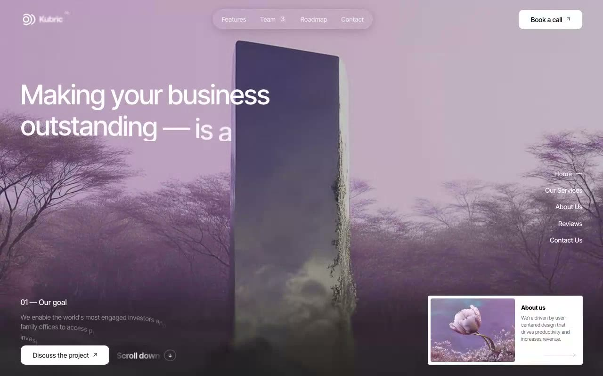

# Kubric™ Hero Landing — Dark Cinematic Hero with Animated SVG Logo (TanStack Start + React 19 + Tailwind v4)

A single-page, desktop-only dark hero landing for the fictional studio **Kubric™**, built on **TanStack Start v1 + React 19 + Vite 7 + Tailwind v4** with file-based routing. Features a looping background video with a progressive 8-layer `backdrop-filter` blur at the bottom, an animated SVG logo with arc stroke-dashoffset reveals, a glass nav pill, a character-by-character headline reveal, a vertical right-side section nav, and a white "About us" card. Everything animates in on first load once the background video is ready. Generated with Claude Fable 5.

[](./demo.mp4)

## What's in the hero

- **Looping background video** (`<video>` with a `<source>` child) that rewinds at 10s.
- **Progressive blur** at the bottom — 8 stacked `backdrop-filter` layers with stepped
  blur radii and stepped gradient masks, plus a darkening gradient overlay.
- **Animated SVG logo** — the circle springs in, two pairs of arcs draw themselves
  (`stroke-dashoffset` + slide), and the "Kubric™" wordmark blur-fades in.
- **Glass nav pill** with 4 links (Team carries a circular "3" badge) and a solid
  white **Book a call** button.
- **Character-by-character headline** — each glyph is wrapped at runtime in a
  `.hero__char` span with a staggered `animationDelay`, sliding up from below.
  The accent word _Science_ is italic-bold.
- **Vertical right-side section nav** whose white underline marker follows the
  active link on click.
- **Bottom row**: the `01 — Our goal` label, a description paragraph, a white
  **Discuss the project** button, an animated **Scroll down** pill, and a white
  horizontal **About us** card with an image and a long arrow.

## Reveal sequence

The `<body>` starts **without** the `is-ready` class, so every keyframe-driven
element is `animation-play-state: paused` and hidden. On mount the page calls
`video.play()`, then adds `is-ready` when the video reaches `readyState >= 4` /
`canplaythrough` (or after a 5s hard fallback). That kicks off the full timeline.

## Stack notes

- File-based routing: `src/routes/__root.tsx` (document shell + head/meta/font
  links) and `src/routes/index.tsx` (the hero). `src/router.tsx` exports
  `getRouter()`. `src/routeTree.gen.ts` is generated by the TanStack Start Vite plugin.
- Tailwind v4 is pulled in via `@import "tailwindcss"` in `src/styles.css`; all
  Kubric styles are plain CSS appended in the same file (no `tailwind.config.js`).
- **Inter Tight** is loaded via `<link>` in the route head — never `@import`-ed in CSS.
- Only standard `backdrop-filter` is authored; Lightning CSS auto-prefixes the
  `-webkit-` variant so Chrome's glass effect survives the build.
- Assets are vendored locally in `src/assets/` (`body.mp4`, `card-image.png`) and
  imported with Vite `?url`, so the project runs fully offline.

## Run it

```bash
npm install
npm run dev        # http://localhost:5199
npm run build      # production build (SSR + client)
npm run verify     # headless Playwright structure / behavior checks
```

> Desktop-only: `html { min-width: 1024px }`. Designed for ≥1024px viewports.

---

Part of the [Hero sections](../) collection in the [claude-directory](../../) — an open-source gallery of AI-generated UI built with Claude Fable 5. [Browse the live gallery](https://pulkitxm.com/claude-directory).
