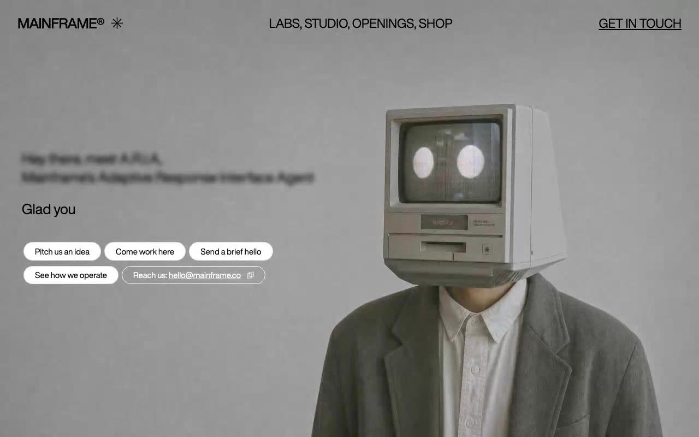

# Mainframe — Mouse-Scrub Video Hero with AI Typewriter (React 19 + TypeScript + Tailwind CSS 3)

[](./demo.mp4)

A full-screen, cinematic hero landing page for a creative agency called Mainframe, featuring a fixed background video that scrubs forward and backward in response to horizontal mouse movement, an AI-assistant-themed blurred intro label, a typewriter-animated headline, and a row of pill-shaped action buttons with a clipboard copy email link. The design pairs HelveticaNowDisplay-Medium headings with HelveticaNowDisplayW01-Rg body text, both vendored locally for offline use. Built with React 19, TypeScript, Vite, and Tailwind CSS v3. Generated with Claude Fable 5.

## Stack

- React 19 + TypeScript + Vite
- Tailwind CSS v3
- Custom `useTypewriter` hook (38ms/char, 600ms start delay)
- Mouse-scrub video seeking throttled via the `seeked` event
- Fonts vendored locally (HelveticaNowDisplay-Medium + HelveticaNowDisplayW01-Rg)

## Highlights

- Fixed background video scrubs forward/backward based on horizontal mouse movement (`SENSITIVITY = 0.8`, anti-flood via `seeked` event deadband)
- Blurred intro label (`filter: blur(4px)`) introduces A.R.I.A, Mainframe's Adaptive Response Interface Agent
- Typewriter headline with blinking cursor (`blink 1s step-end infinite`)
- 4 white pill CTA buttons + 1 outline pill with clipboard email copy (`hello@mainframe.co`)
- Mobile hamburger morphs into an X; overlay with `bg-white/95 backdrop-blur-sm`

## Run

```bash
npm install
npm run dev
npm run build    # tsc -b && vite build
npm run preview
```

---

Part of the [Hero sections](../) collection in the [claude-directory](../../) — an open-source gallery of AI-generated UI built with Claude Fable 5. [Browse the live gallery](https://pulkitxm.com/claude-directory).
