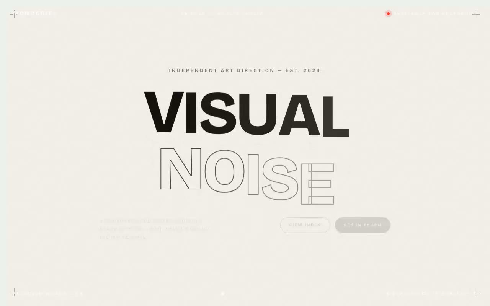

# Monocrit Studio — Cursor-Driven Interactive Portfolio Hero (Vanilla HTML + CSS + JS)

[](./demo.mp4)

A full-viewport, cursor-driven hero section for a fictional independent art-direction studio called Monocrit Studio, built in a quiet near-monochrome Swiss-brutalist aesthetic: huge Bricolage Grotesque display type centered in a field of warm off-white paper (`#F2F0EB`), framed by hairline rules and tight uppercase eyebrow labels, with a single signal-red accent (`#FF3B2F`). The floating image card replaces the native cursor and lerps toward it with slight inertia and velocity-based tilt; headline letters magnetically recoil away from the cursor and spring back; and accumulated pointer travel cycles a stack of six portfolio images with a crossfade. Header and footer use `mix-blend-difference` to stay legible over both paper and dark card. Runs fully offline — font and all six images vendored locally. Generated with Claude Fable 5.

On coarse-pointer devices the cursor-follow is disabled and images auto-cycle on a timer. Motion respects `prefers-reduced-motion`.

## Run

This is a static project — open `index.html` in a browser, or serve the folder:

```sh
python3 -m http.server 8000
```

See `prompt.md` for the full build spec; `demo.mp4` shows it in motion.

---

Part of the [Hero sections](../) collection in the [claude-directory](../../) — an open-source gallery of AI-generated UI built with Claude Fable 5. [Browse the live gallery](https://pulkitxm.com/claude-directory).
