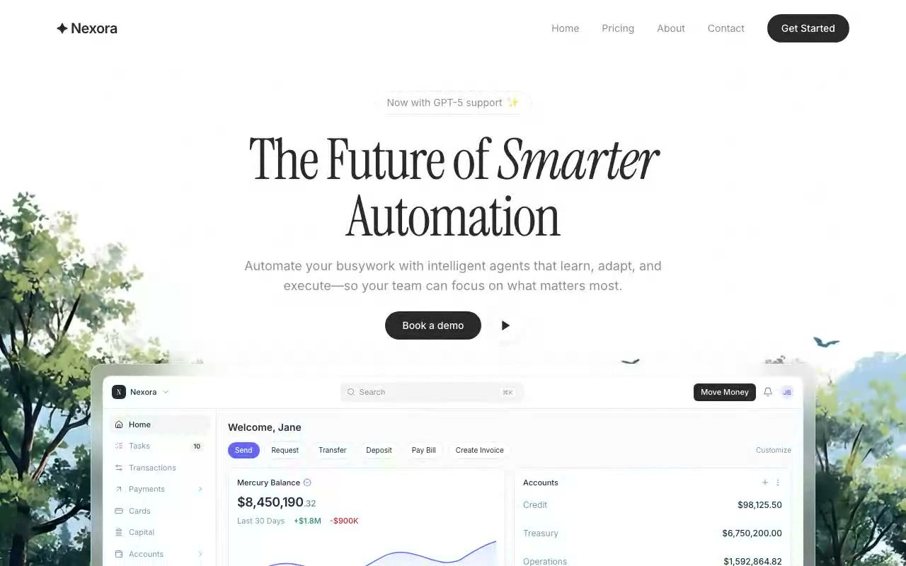

# Nexora Automation Hero — SaaS Landing Hero with Frosted-Glass Dashboard Preview (React 18 + Framer Motion + Tailwind CSS)

[](./demo.mp4)

A single-screen SaaS landing-page hero for a fictional automation product called Nexora — "The Future of *Smarter* Automation". A single 100vh, no-scroll page: minimal navbar, fullscreen ambient background video, Instrument Serif display type over Inter body text, and a fully custom-coded (no images) Mercury-style banking dashboard preview floating in a frosted-glass frame that intentionally overflows and clips at the bottom of the viewport. All colors use semantic `hsl(var(--token))` design tokens. Built with React 18, TypeScript, Vite, Tailwind CSS 3, and Framer Motion. Generated with Claude Fable 5.

## Stack

- React 18 + TypeScript + Vite
- Tailwind CSS 3 (+ `tailwindcss-animate`), all colors via semantic `hsl(var(--token))` design tokens
- framer-motion staggered entrance animations
- lucide-react icons, shadcn/ui Button

## Run

```bash
npm install
npm run dev
```

## Verify (CLI only)

```bash
npm run build
npm run preview &   # serves dist on :4173
npm run verify      # headless Playwright checks (desktop + mobile) + screenshots
```

---

Part of the [Hero sections](../) collection in the [claude-directory](../../) — an open-source gallery of AI-generated UI built with Claude Fable 5. [Browse the live gallery](https://pulkitxm.com/claude-directory).
