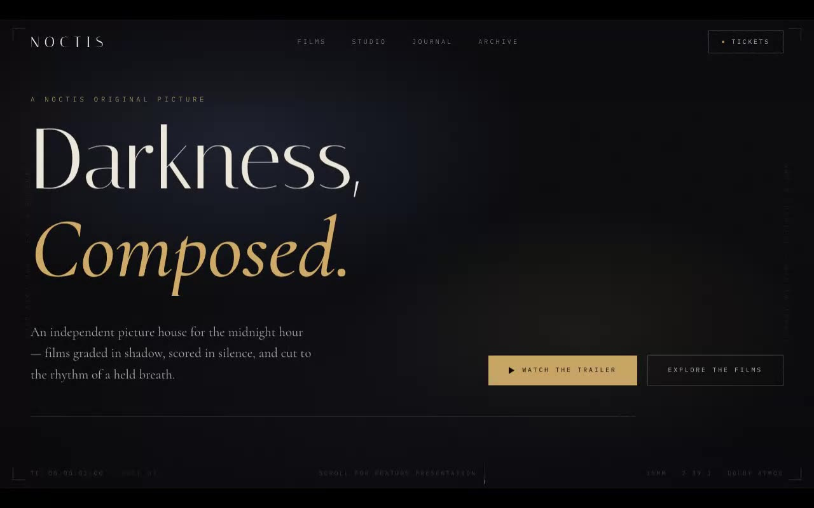

# NOCTIS — Cinematic Film-Grade Video Hero Section (React + TypeScript + Vite + Tailwind CSS v4)

[](./demo.mp4)

A full-screen dark hero section built for an imagined independent picture house, featuring a Cloudinary background video framed in a letterboxed, film-graded cinematic treatment: animated film grain, vignette, viewfinder corner ticks, vertical credit rails, a live 24fps SMPTE timecode, and a staggered title-card entrance. Typography is Italiana (display), Cormorant italic (accent/body), and IBM Plex Mono (credit micro-labels) in champagne gold on near-black — a premium landing page aesthetic for cinematic brands. Generated with Claude Fable 5.

**Type**: Italiana (display) · Cormorant italic (accent/body) · IBM Plex Mono
(credit micro-labels) — champagne gold on near-black.

## Stack

React 18 + TypeScript + Vite + Tailwind CSS v4.

## Run

```sh
npm install
npm run dev
```

## Verify

```sh
npm run build
npm run verify   # headless Chromium checks + screenshots
```

`scripts/verify.mjs` asserts the exact `<video>` element from `prompt.md`
(attributes, classes, source URL/type), full-viewport coverage, the dark
cinematic frame (vignette, grain, letterbox), typography, the ticking
timecode, mobile responsiveness, and console health.

---

Part of the [Hero sections](../) collection in the [claude-directory](../../) — an open-source gallery of AI-generated UI built with Claude Fable 5. [Browse the live gallery](https://pulkitxm.com/claude-directory).
