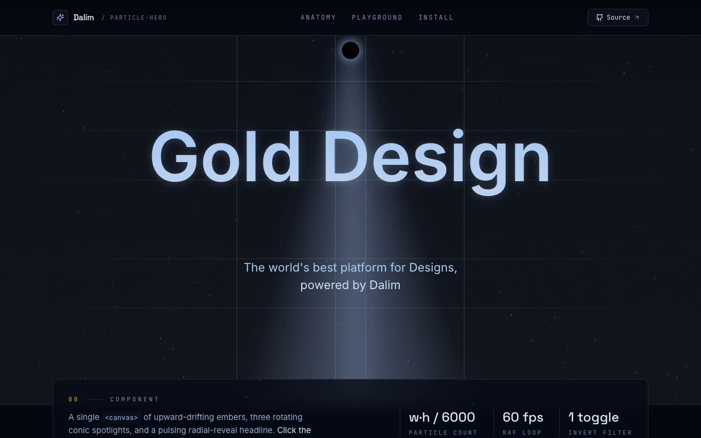

# Particle Hero — Canvas Particle Animation Hero Component (React + Vite + Tailwind CSS v4 + shadcn/ui)

[](./demo.mp4)

A full-bleed night-sky hero section built around the `ParticleHero` shadcn/ui component: a Canvas 2D animation of upward-drifting ember particles floats behind three rotating conic-gradient spotlights and a pulsing, radial-reveal "Gold Design" headline. A glowing orb toggles gold mode, inverting and over-brightening the entire scene from cold ice-blue to warm gold. The component is integrated into a proper shadcn/ui project structure and demonstrated with a floating navbar, anatomy grid, live props playground, and install band — making it a ready-to-drop-in hero section for design systems and SaaS landing pages. Generated with Claude Fable 5.

## Stack

- Vite + React 19 + TypeScript (strict)
- Tailwind CSS v4 (`@tailwindcss/vite`)
- Canvas 2D (no WebGL / no animation library — the hero is pure DOM + `<canvas>`)
- `lucide-react` (icons), `clsx` + `tailwind-merge` (the shadcn `cn` helper)
- Vendored fonts: Space Grotesk (display), Inter (body), JetBrains Mono (data/code)

## Run

```sh
npm install
npm run dev      # dev server
npm run build    # type-check + production build
npm run verify   # headless Playwright checks against the production build
```

`npm run verify` boots `vite preview`, then asserts every observable prompt
requirement — the integrated component renders, the canvas actually draws
particles, the gradient-clipped headline + "powered by Dalim" tagline are
present, the orb toggles `.gold-mode` (and the canvas's gold drop-shadow filter),
the playground drives the props live and prints the right JSX, the install
section lists the runtime deps, the three fonts load, the layout is responsive,
and the console stays clean — saving desktop + mobile screenshots to
`screenshots/`.

---

## Integration notes (answering the prompt)

### Does the codebase support shadcn / Tailwind / TypeScript?

Yes — this project is configured for all three out of the box. From scratch:

```sh
# 1. A TypeScript React app (Vite shown here; Next.js works too)
npm create vite@latest my-app -- --template react-ts
cd my-app

# 2. Tailwind CSS v4
npm install tailwindcss @tailwindcss/vite
#    then add `tailwindcss()` to vite.config plugins and `@import "tailwindcss";`
#    to your global stylesheet.

# 3. Initialise shadcn/ui (creates components.json + @/lib/utils with cn())
npx shadcn@latest init

# 4. The component's runtime dependencies
npm install lucide-react        # shadcn init already adds clsx + tailwind-merge
```

### Default paths for components and styles

`components.json` sets the standard shadcn aliases: `@/components/ui` for
primitives and `@/lib/utils` for the `cn()` helper, with `@` → `./src` wired in
`vite.config.ts` and `tsconfig.json`. The component lives at
`src/components/ui/particle-hero.tsx`. Keeping it under **`/components/ui`** is
what makes `import { ParticleHero } from "@/components/ui/particle-hero"` portable
across any shadcn project, exactly as the prompt's `demo.tsx` imports it.

### `styled-jsx` → a scoped stylesheet

The source component shipped its keyframes, gold-mode filters, and the
`@property --p` registration inside a Next.js `<style jsx>` block. `styled-jsx` is
a Next-only compiler feature, so in this Vite app the equivalent is a co-located
**`particle-hero.css`** imported from the `.tsx` file. Every rule is scoped under
`.particle-hero` so the global `invert()` filters and animations never leak.

### Answering the prompt's integration questions

- **Props passed to the component?** None are required — `<ParticleHero />` works
  bare. Optional props (`title`, `subtitle`, `defaultGold`, `onGoldModeChange`)
  let the showcase playground steer it; defaults reproduce the original copy.
- **State management?** A single `useState` for gold mode, lifted to the page via
  the optional `onGoldModeChange` callback. No context, no theme provider.
- **Required assets?** None. The component is type + canvas only, so there are no
  Unsplash images to fill; `lucide-react` supplies the showcase's chrome icons.
- **Responsive behavior?** The hero scales with `em` units derived from the
  viewport, the canvas re-fits via a `ResizeObserver`, and the showcase grids
  collapse to a single column with the nav hiding on small screens.
- **Where to use it?** Above the fold, as the page hero — which is exactly how the
  showcase mounts it.

### Accessibility & motion

The orb is a real `<button>` with `aria-pressed` and a label; focus styling is
visible throughout, and `prefers-reduced-motion` holds the scene in its settled,
fully-visible state instead of running the load/spotlight/sweep loops.

---

Part of the [Hero sections](../) collection in the [claude-directory](../../) — an open-source gallery of AI-generated UI built with Claude Fable 5. [Browse the live gallery](https://pulkitxm.com/claude-directory).
