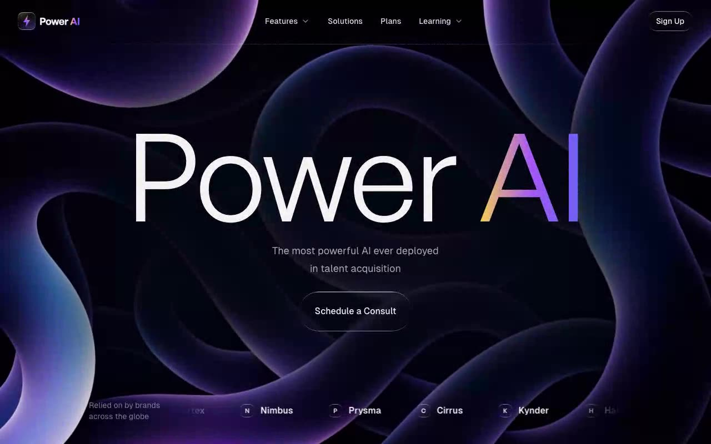

# Power AI — Dark Hero Section with Video Fade Loop and Logo Marquee (React + Vite + Tailwind CSS)

[](./demo.mp4)

A full-screen dark hero section for a fictional AI talent-acquisition platform. A looping background video fades in and out via a custom `requestAnimationFrame` loop, a giant 220px General Sans headline carries an indigo → purple → amber gradient, and a liquid-glass logo marquee scrolls along the bottom — all on a deep blue-purple background with staggered rise entrance animations. This hero landing page demonstrates advanced CSS techniques including liquid-glass frosted surfaces, viewport-spanning gradient text, and RAF-driven video opacity control, ideal as a dark SaaS or AI product hero. Generated with Claude Fable 5.

## Highlights

- **Theme** — deep dark blue-purple (`260 87% 3%`) with off-white foreground,
  driven by HSL CSS variables in `src/index.css`
- **Type** — General Sans (Fontshare) for display, Geist Sans
  (`@fontsource/geist-sans`) for body
- **Background video** — `absolute inset-0 object-cover`, starts at opacity 0;
  a rAF loop fades it in over the first 0.5s and out over the last 0.5s; on
  `ended` it resets to opacity 0, waits 100ms, and replays. No gradient overlays
- **Legibility plate** — a 984×527 `bg-gray-950` shape at `blur-[82px]`
  centered behind the content
- **Liquid glass** — frosted buttons and marquee icons with a masked gradient
  hairline rim (`.liquid-glass` in `src/index.css`)
- **Marquee** — six fictional brands duplicated for a seamless
  `translateX(0% → -50%)` 20s linear loop, edge-faded with a CSS mask

## Run

```sh
npm install
npm run dev       # dev server
npm run build     # type-check + production build
npm run preview   # serve dist on :4861
```

## Verify (headless, CLI-only)

```sh
npm run preview &
npm run verify    # Playwright checks against http://localhost:4861
```

`scripts/verify.mjs` asserts the video fade-loop behavior, theme variables,
typography, navbar, headline gradient, CTA, liquid-glass styling, and marquee
animation at desktop and mobile viewports.

`src/assets/logo.png` is generated by `npm run make:logo`
(`scripts/make-logo.mjs` renders the mark with headless Chromium).

---

Part of the [Hero sections](../) collection in the [claude-directory](../../) — an open-source gallery of AI-generated UI built with Claude Fable 5. [Browse the live gallery](https://pulkitxm.com/claude-directory).
