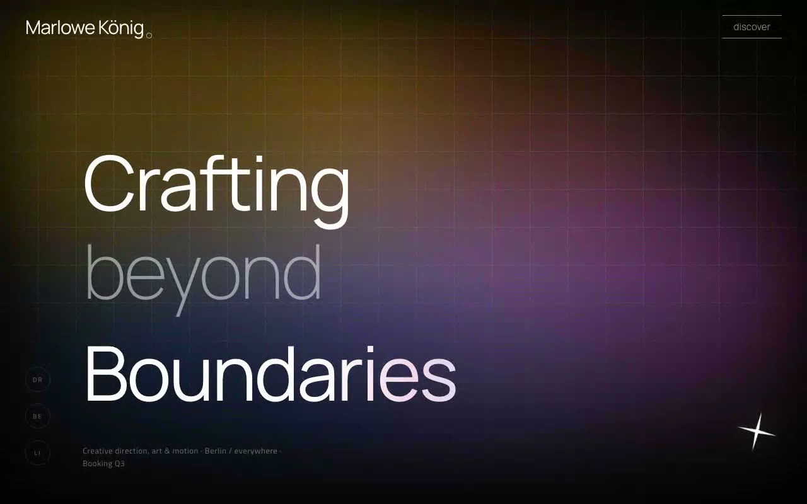

# Prisma Noir — Spectral Darkroom Creative Director Hero Section (Vanilla HTML + CSS + JS)

[](./demo.mp4)

A full-viewport above-the-fold hero for fictional creative director Marlowe König, built in the "Spectral Darkroom" aesthetic: a near-black `#060606` canvas lit from within by slow-drifting, soft-focus spectral color blobs (amber, magenta, electric blue, tangerine, violet) blended in screen mode, overlaid with a faint technical grid, film grain, and a deep inset vignette. The mood is cinematic and gallery-grade — everything is type, light, and motion. Dependency-free, hand-written HTML/CSS/JS with locally vendored Manrope and Titillium Web fonts for full offline use. This hero section suits high-end creative portfolio landing pages and editorial design showcases. Generated with Claude Fable 5.

Content is bottom-anchored over a layered z-stack. Motion includes a 20s zoom-and-rotate drift on the blob layer, a vertical word loop that cycles the headline through BOUNDARIES → EXPECTATIONS → CONVENTIONS → REALITY inside a clipped mask, subtle pointer parallax on the blobs and star glyph, and a fullscreen "Discover" overlay that slides up and runs marquee tickers on hovered rows (Esc to close). All motion respects `prefers-reduced-motion`. Dependency-free hand-written HTML/CSS/JS with fonts vendored locally for offline use.

## Run

This is a static project — open `index.html` in a browser, or serve the folder:

```sh
python3 -m http.server 8000
```

See `prompt.md` for the full build spec; `demo.mp4` shows it in motion.

---

Part of the [Hero sections](../) collection in the [claude-directory](../../) — an open-source gallery of AI-generated UI built with Claude Fable 5. [Browse the live gallery](https://pulkitxm.com/claude-directory).
