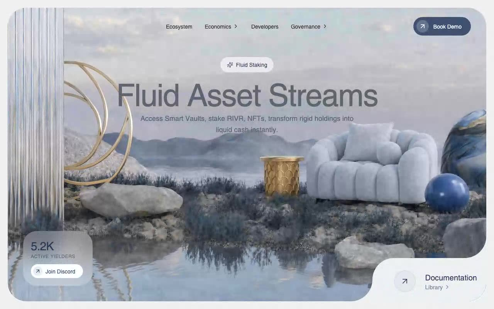

# RIVR — DeFi Dashboard Glassmorphism Hero Section (React + TypeScript + Vite + Tailwind CSS v4 + Motion)

[](./demo.mp4)

A hero section for the fictional DeFi dashboard **RIVR**, built to an exact glassmorphism spec: a full-bleed video background inside a rounded, inset frame, frosted-glass badge and stat card, and a faux-cutout "Documentation" corner achieved with inverted-radius SVG masks. Entrance animations and micro-interactions are driven by the `motion/react` library, making this an ideal reference for premium DeFi or Web3 landing pages with a clean, modern UI. Generated with Claude Fable 5.

## Stack

- React 18 + TypeScript + Vite
- Tailwind CSS v4 (`@tailwindcss/vite`, `@theme` tokens)
- `motion` (`motion/react`) for entrance animations and micro-interactions
- `lucide-react` for icons

## Run

```bash
npm install
npm run dev       # dev server
npm run build     # typecheck + production build
npm run preview   # serve the production build
```

## Verify (headless, CLI-only)

```bash
npm run build
npm run preview &
npm run verify    # Playwright checks against http://localhost:4173
```

The verify script asserts the exact video URL, autoplay/muted/loop/playsInline flags,
typography (80px Helvetica headline at lg, #5E6470), glassmorphism computed styles
(backdrop-filter blur + translucent whites), navbar items and dropdown chevrons,
bottom-left stat card positioning, the corner-cutout SVG masks, and the mobile layout
(RIVR wordmark, hidden menu, repositioned card) across desktop and mobile viewports.

---

Part of the [Hero sections](../) collection in the [claude-directory](../../) — an open-source gallery of AI-generated UI built with Claude Fable 5. [Browse the live gallery](https://pulkitxm.com/claude-directory).
