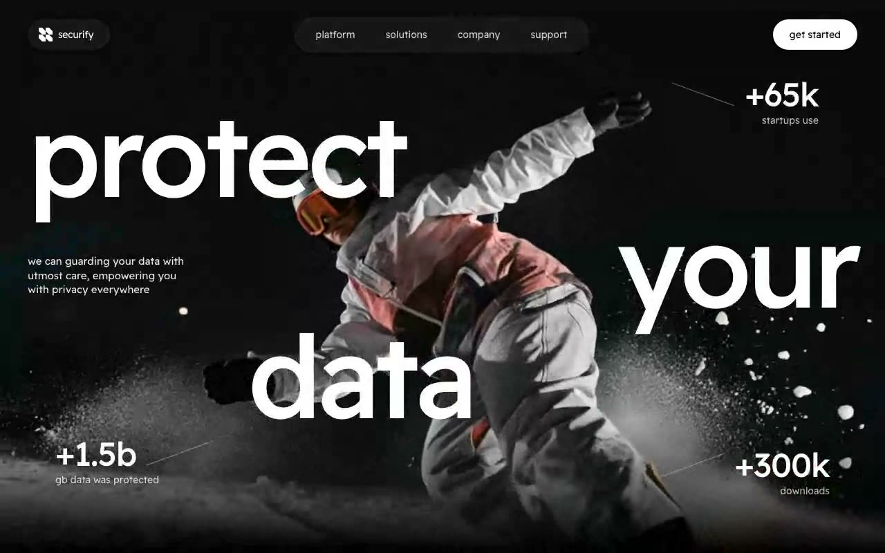

# securify — Data-Security SaaS Hero Section (React + TypeScript + Tailwind CSS + Vite)

[](./demo.mp4)

A full-screen hero section for the fictional data-security SaaS **securify**, featuring a looping fullscreen background video with a bottom fade-to-black gradient, a floating pill-shaped glass navbar, and three giant staggered lowercase headline words — "protect / your / data" — scaled with `vw` viewport units for maximum visual impact. Diagonal-divider stat blocks call out +65k startups, +1.5b GB protected, and +300k downloads. The pure black, white, and neutral palette with Readex Pro typeface gives this landing page a confident, minimal aesthetic suited to security, privacy, and enterprise SaaS products. Generated with Claude Fable 5.

- Looping fullscreen background video with a bottom fade-to-black gradient
- Floating pill-shaped navbar (brand pill, link pill, "get started" button)
- Three giant staggered lowercase headline words — "protect / your / data" — scaled with `vw` units
- Diagonal-divider stat blocks (+65k startups, +1.5b gb protected, +300k downloads)
- Palette: pure black, white, neutral-900 and white-opacity variants; typeface: Readex Pro

## Run

```bash
npm install
npm run dev
```

## Verify

```bash
npm test                 # vitest unit tests (jsdom)
npm run build            # tsc --noEmit + vite build
npm run preview &        # serves dist on :4723
npm run verify           # playwright headless checks (desktop + mobile)
```

---

Part of the [Hero sections](../) collection in the [claude-directory](../../) — an open-source gallery of AI-generated UI built with Claude Fable 5. [Browse the live gallery](https://pulkitxm.com/claude-directory).
