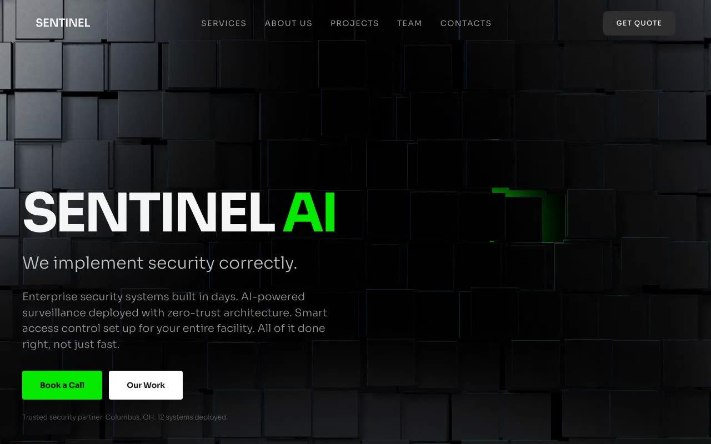

# SENTINEL AI — Dark Security Hero Section with Interactive 3D Spline Background (React + Vite + TypeScript + Tailwind CSS + shadcn/ui)

[](./demo.mp4)

A full-screen dark hero landing page for the fictional security company **SENTINEL AI**, floating a fixed transparent navbar and a bottom-left-anchored content block over an embedded Spline 3D scene that fills the viewport. Content clicks pass through to the interactive 3D scene via `pointer-events-none`, with fluid `clamp()` typography, staggered `fade-up` blur-and-translate reveal animations, and a vivid green primary accent on a charcoal background — a striking dark hero section for AI, security, and enterprise SaaS landing pages. Generated with Claude Fable 5.

- **Stack**: React 18, Vite 5, TypeScript, Tailwind CSS 3, shadcn/ui (Button), `@splinetool/react-spline` + `@splinetool/runtime`
- **Font**: Sora (300–700) via Google Fonts
- **Theme**: dark-only HSL token system — charcoal background, vivid green primary (`119 99% 46%`)
- **3D**: lazy-loaded Spline scene as a full-bleed interactive background, with a `bg-black/30` legibility overlay
- **Motion**: staggered `fade-up` reveals (blur + translate) on every hero element

## Run

```sh
npm install
npm run dev      # dev server
npm run build    # type-check + production build
npm run preview  # serve the production build
```

See `PROMPT.txt` for the original experiment prompt.

---

Part of the [Hero sections](../) collection in the [claude-directory](../../) — an open-source gallery of AI-generated UI built with Claude Fable 5. [Browse the live gallery](https://pulkitxm.com/claude-directory).
