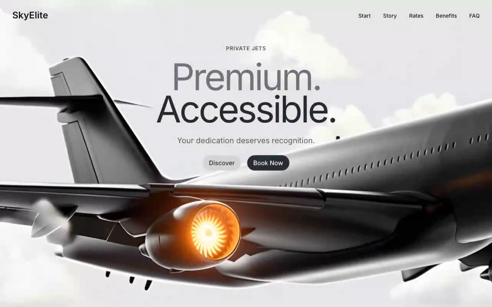

# SkyElite — Private Jet Hero Section (React + TypeScript + Tailwind CSS)

[](./demo.mp4)

A premium private-jet landing page hero section featuring a full-viewport looping video background, glass mobile dropdown navigation, and an overlapping two-line headline ("Premium." / "Accessible.") with a staggered page-load reveal. Designed with a calm, light aesthetic for luxury travel and charter aviation use cases. Generated with Claude Fable 5.

## Stack

- React 18 + TypeScript
- Vite
- Tailwind CSS
- Lucide React (Menu / X icons)
- Inter (Google Fonts, 400–700)

## Run

```bash
npm install
npm run dev       # local dev server
npm run build     # typecheck + production build
npm run preview   # serve the production build
npm test          # vitest spec-compliance suite
```

See `prompt.md` for the original experiment prompt.

---

Part of the [Hero sections](../) collection in the [claude-directory](../../) — an open-source gallery of AI-generated UI built with Claude Fable 5. [Browse the live gallery](https://pulkitxm.com/claude-directory).
