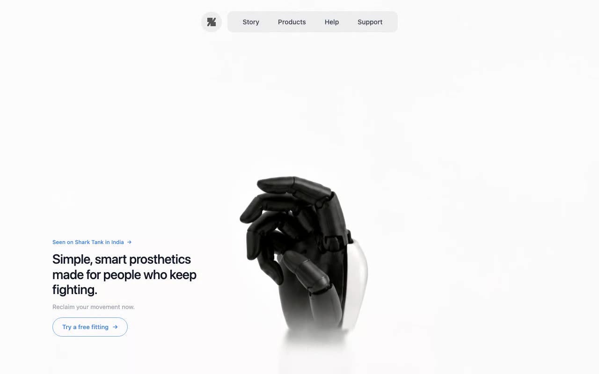

# Smart Prosthetics — Cinematic Hero Section (React + TypeScript + Tailwind CSS)

[](./demo.mp4)

A single-page, full-screen hero section for a smart prosthetics brand featuring a muted autoplaying background video, a centered pill-style navbar with two separate pill components, and bottom-left-aligned hero copy with a badge, headline, subtext, and a CTA with hover micro-interactions. Built with React 18, TypeScript, and Tailwind CSS on Vite; the entire page lives in `src/App.tsx`. Generated with Claude Fable 5.

## Run

```bash
npm install
npm run dev      # dev server
npm run build    # type-check + production build
```

## Verify

```bash
npm run build
node scripts/verify.mjs
```

`scripts/verify.mjs` serves `dist/` and runs headless Chromium (Playwright)
assertions: exact video attributes/URL, wrapper styles, logo SVG, nav links,
pill backgrounds, hero text and sizes, hover states (CTA fill, arrow nudge,
nav link color), anchor count, and responsive breakpoints. It also captures
desktop/mobile screenshots under `scripts/`.

---

Part of the [Hero sections](../) collection in the [claude-directory](../../) — an open-source gallery of AI-generated UI built with Claude Fable 5. [Browse the live gallery](https://pulkitxm.com/claude-directory).
