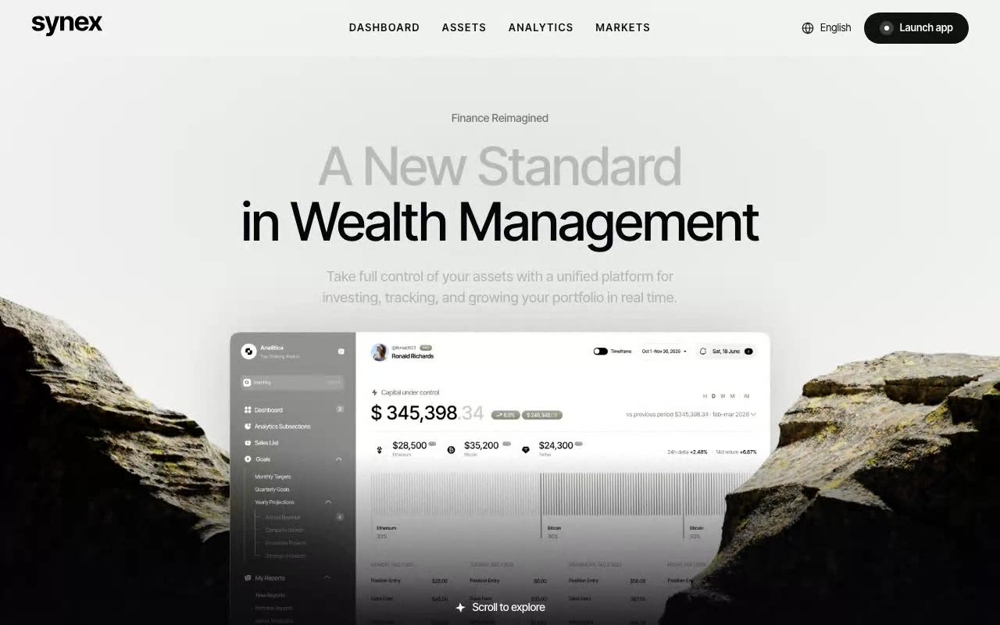

# Synex — Wealth Management Hero Section (React + TypeScript + Framer Motion + Tailwind CSS)

[](./demo.mp4)

A full-viewport hero section for the fictional wealth-management platform Synex. The aesthetic is editorial-minimal with a tactile, organic twist: a warm off-white paper background, large refined Inter Tight typography, two photorealistic stones flanking the bottom corners, and a product dashboard screenshot rising centrally between them. Premium, calm, and confident — Apple keynote crossed with Swiss editorial design, grounded by natural texture. Generated with Claude Fable 5.

## Signature interaction

Hover either stone and a soft, cursor-following circle of **moss** is painted
onto it through a radial-gradient CSS mask. The reveal radius is a Framer Motion
value (`0 → 120` on enter) smoothed by a spring (`stiffness 200`, `damping 25`),
so the wet patch grows organically and springs closed on leave.

## Load choreography

A staggered blur-up cascade brings the page in top-to-bottom: eyebrow →
headline line 1 → headline line 2 → subhead, each animating from
`opacity 0 + blur + y-offset`. The stones slide in from the edges, and the
dashboard rises with an expo-out ease. The scroll indicator gently bobs while
its star slowly spins.

## Tech stack

React 18 · Vite · TypeScript · Tailwind CSS v3 · Framer Motion · lucide-react

```
src/
  pages/Index.tsx              # page entry — <main> + sr-only <h1>, sets title/meta
  components/synex/
    Hero.tsx                   # full layered composition
    Navbar.tsx                 # fixed 3-column grid navbar + CTA
    StoneReveal.tsx            # photoreal stone + mossy cursor reveal
```

## Assets

All assets are **vendored locally** under `public/assets/` (Synex wordmark,
4-point star, four stone PNGs, and the dashboard screenshot — originally from
`qclay.design/lovable/synex`). The **Inter Tight** font is also vendored locally
as a variable woff2 under `public/fonts/` so the project runs fully offline.

## Run

```bash
npm install
npm run dev      # http://localhost:5173
npm run build    # type-check + production build
```

---

Part of the [Hero sections](../) collection in the [claude-directory](../../) — an open-source gallery of AI-generated UI built with Claude Fable 5. [Browse the live gallery](https://pulkitxm.com/claude-directory).
