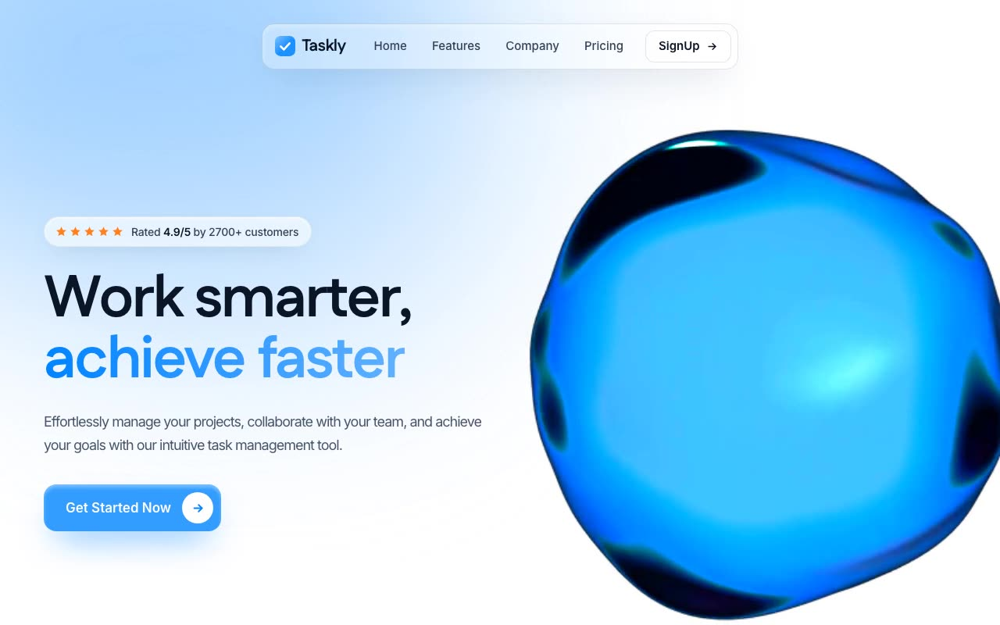

# Taskly — Liquid Glass Hero Section (React + TypeScript + Tailwind CSS + Vite)

[](./demo.mp4)

A high-fidelity "liquid glass" landing hero for a task-management SaaS, combining a frosted-glass sticky navbar, a glassmorphic primary CTA, and a vivid color-graded "glassy orb" video on the right — all set against a pure-white page with a soft layered blue gradient glow. Fully responsive, transitioning from a single-column mobile layout to a dual-column desktop layout. Generated with Claude Fable 5.

## What's in it

- **Strong liquid-glass navbar** — sticky at `top: 30px`, centered `w-fit`, `backdrop-blur(50px)`, `rgba(255,255,255,0.3)` fill, 1px `rgba(0,0,0,0.1)` stroke, inset white highlight.
- **Hero** — Fustat Bold 75px / 1.05 / -2px headline, Inter 18px / -1px subheadline, 4.9/5 social-proof badge with five `#FF801E` stars, and a `rgba(0,132,255,0.8)` glass CTA with a white circular arrow and 1.02 hover scale.
- **Glassy orb** — the future.co `orb-purple.webm` asset, `mix-blend-screen`, `scale(1.25)`, color-graded to electric brand blue via `hue-rotate(-55deg) saturate(250%) brightness(1.2) contrast(1.1)`.
- **Layered glow** — blurred `#60B1FF` / `#319AFF` ellipses in the top-left over a pure-white page.
- **Trusted-by strip** — 5 grayscale SVG placeholder logos at a 100px gap.

### Note on the orb blend

The source video is a bright orb on solid black; `mix-blend-screen` can only lighten, so over a pure-white page it would render invisible. A deep ink-blue radial "energy field" sits behind the video: the orb screens over its dark core in vivid blue, and the field's fade-to-transparent edge lets the video's black background dissolve seamlessly into the white page. A CSS-only fallback orb renders if the remote webm fails to load.

## Run

```bash
npm install
npm run dev       # dev server
npm run build     # tsc + vite build
npm run preview   # serve dist on :4173
npm run verify    # headless Playwright checks against :4173
```

---

Part of the [Hero sections](../) collection in the [claude-directory](../../) — an open-source gallery of AI-generated UI built with Claude Fable 5. [Browse the live gallery](https://pulkitxm.com/claude-directory).
