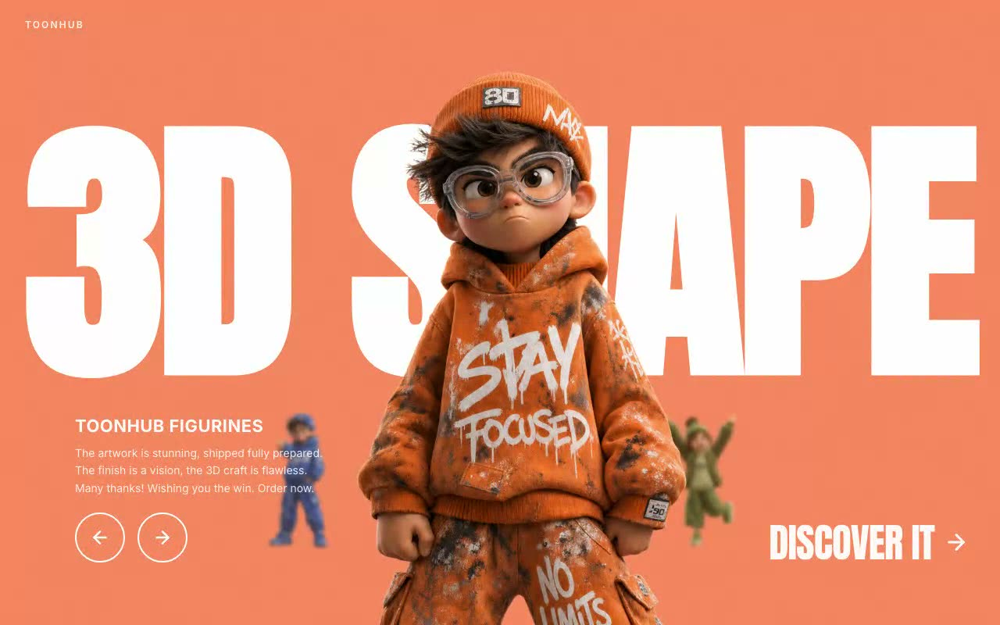

# TOONHUB — 3D Figurine Carousel Hero Section (React + TypeScript + Tailwind CSS)

[](./demo.mp4)

A single full-viewport hero section featuring a character-figurine carousel with a giant "3D SHAPE" ghost headline, role-based 3D-ish depth positioning (center / left / right / back), and a background color that crossfades with each slide over 650ms. Built for toy and collectibles storefronts or animated brand showcases. Built with React, TypeScript, Vite, Tailwind CSS, and Lucide React. Display font: Anton. Body font: Inter. Generated with Claude Fable 5.

## Run

```sh
npm install
npm run dev      # dev server
npm run build    # type-check + production build
npm run preview  # serve the production build
```

## Verify (headless, CLI-only)

```sh
npm run build
npx vite preview --port 4731 &
node scripts/verify.mjs http://localhost:4731/
```

The script drives headless Chromium through 35 checks: structure, fonts, grain
overlay, role geometry per breakpoint, the 650ms cubic-bezier transitions, full
next/prev cycling with background-color assertions, the animation lock, button
hover states, and mobile (<640px) layout.

---

Part of the [Hero sections](../) collection in the [claude-directory](../../) — an open-source gallery of AI-generated UI built with Claude Fable 5. [Browse the live gallery](https://pulkitxm.com/claude-directory).
