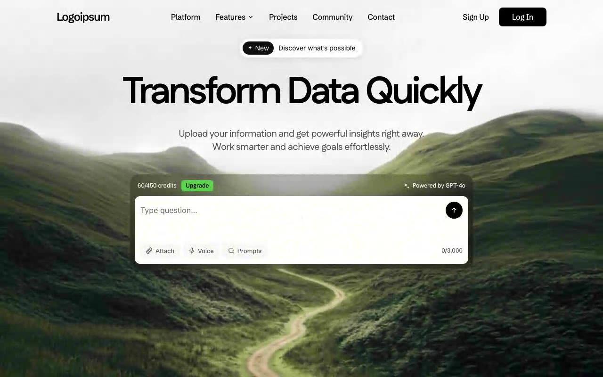

# Transform Data Hero — AI Data Hero Section (React + TypeScript + Vite + Tailwind CSS)

[](./demo.mp4)

A modern hero section over a full-screen looping video background for an AI data-transformation product. Features a "Transform Data Quickly" headline in Fustat 80px, a glassy AI-style search box with credit counter and action buttons, and a navigation bar — all overlaid on a full-bleed video with a custom requestAnimationFrame fade system. Built with React 18, TypeScript, Vite, and Tailwind CSS. Generated with Claude Fable 5.

The video loop uses a **custom requestAnimationFrame fade system** (no CSS
transitions): 250ms fade-in on load and on every loop restart, 250ms fade-out
once 0.55s remain, a `fadingOutRef` guard against repeated `timeupdate`
triggers, and a 100ms black hold on `ended` before seeking back to 0 and
fading back in. Every new fade cancels running frames and resumes from the
current opacity.

## Stack

- React 18 + TypeScript + Vite
- Tailwind CSS
- Fonts: Schibsted Grotesk, Inter, Noto Sans, Fustat (400–700)
- All SVG icons live in a single imported file: `src/components/icons.tsx`

## Run

```bash
npm install
npm run dev      # local dev server
npm run build    # production build
npm run verify   # headless Playwright verification of the whole spec
```

`npm run verify` serves `dist/`, opens headless Chromium and asserts the
typography, layout, spacing, colors, component content, and the full video
fade lifecycle (fade-in → fade-out near end → reset → fade back in).

---

Part of the [Hero sections](../) collection in the [claude-directory](../../) — an open-source gallery of AI-generated UI built with Claude Fable 5. [Browse the live gallery](https://pulkitxm.com/claude-directory).
