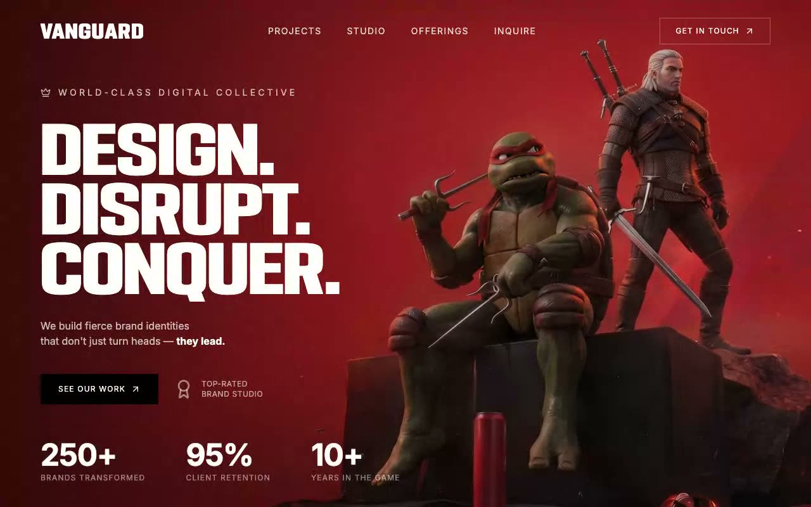

# Vanguard — Creative Agency Hero Landing Page (React + TypeScript + Tailwind CSS + Vite)

[](./demo.mp4)

A fullscreen hero landing page for the fictional creative agency Vanguard. A single viewport-height section with a looping background video, the custom display font PODIUM Sharp, staggered fade-up entrance animations, and a fully responsive layout with a mobile menu overlay. Left-aligned hero content includes a three-line "Design. Disrupt. Conquer." headline, stats row, and CTA. Generated with Claude Fable 5.

**Stack:** React 18 · TypeScript · Tailwind CSS 3 · Vite 5 · lucide-react · Vitest

## Run

```bash
npm install
npm run dev
```

## Test & build

```bash
npm test           # vitest smoke tests (jsdom)
npm run build      # type-check + production build
npm run preview    # serve the production build
```

---

Part of the [Hero sections](../) collection in the [claude-directory](../../) — an open-source gallery of AI-generated UI built with Claude Fable 5. [Browse the live gallery](https://pulkitxm.com/claude-directory).
