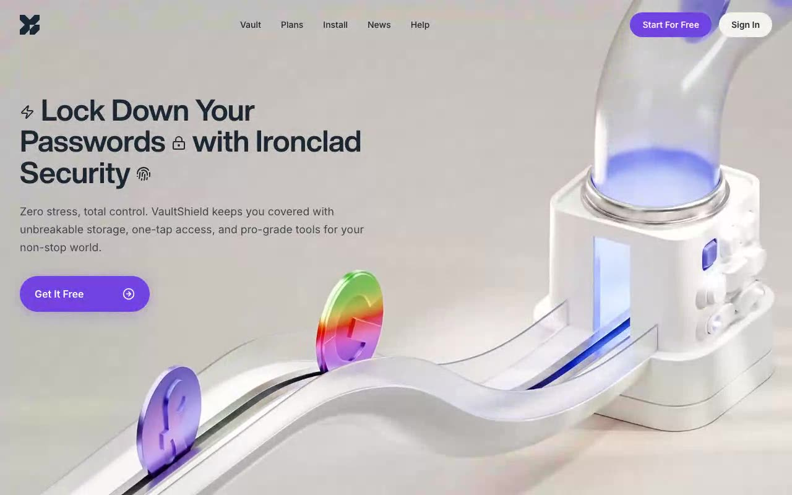

# VaultShield — Cinematic Password-Manager Hero Section (React + TypeScript + Framer Motion)

[](./demo.mp4)

A full-viewport hero section for a fictional password-manager app, **VaultShield**, featuring a looping background video, staggered Framer Motion entrance animations, inline Lucide icons baked into the heading, and a responsive mobile slide-in sheet. The dark-and-purple visual identity pairs Helvetica Now Display Bold headlines with Inter body text over a cinematic video backdrop, making it ideal as a landing page hero for security or productivity SaaS products. Generated with Claude Fable 5.

## Highlights

- Full-viewport CloudFront background video (`autoPlay muted loop playsInline`, `object-cover`)
- `Helvetica Now Display Bold` display face + `Inter` body, wired through CSS variables
- Hero heading with inline Lucide icons (Zap, LockKeyhole, Fingerprint) baked into the line
- Staggered fade-up entrance (heading → subtext → CTA) on a `[0.22, 1, 0.36, 1]` ease
- Mobile slide-in menu sheet (`min(88vw, 360px)`, `#CFC8C5`) with blurred backdrop, staggered links, Escape/backdrop close, and body scroll lock
- CTA pill with purple glow, hover scale + brightness, tap shrink

## Run

```bash
npm install
npm run dev        # dev server
npm run build      # type-check + production build
```

## Verify (headless, CLI-only)

```bash
npm run build
npx vite preview --port 4723 &
node scripts/verify.mjs http://localhost:4723
```

The script drives headless Chromium through desktop (1440×900) and mobile (390×844) passes, asserting the video wiring, fonts, CSS variables, nav, heading/subtext/CTA computed styles, entrance animation completion, hover behavior, and the full mobile-sheet lifecycle.

---

Part of the [Hero sections](../) collection in the [claude-directory](../../) — an open-source gallery of AI-generated UI built with Claude Fable 5. [Browse the live gallery](https://pulkitxm.com/claude-directory).
