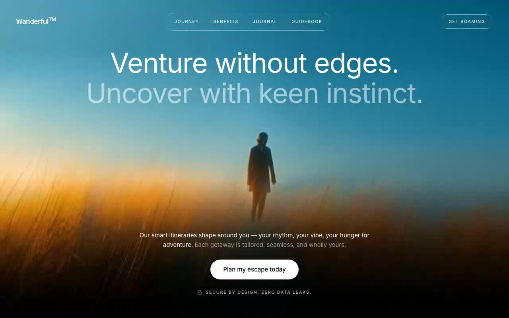

# Wanderful — Cinematic Travel Hero Section (React + TypeScript + GSAP + Tailwind CSS)

[](./demo.mp4)

A full-viewport cinematic hero section for a travel brand, **Wanderful**, featuring a fixed looping background video with GSAP-driven mouse parallax drift, a liquid-glass navigation bar, and staggered fade-in headline copy over a pure black canvas. The parallax effect lerps the video position toward the cursor at `0.06` factor per frame via `requestAnimationFrame`, giving an organic depth without any 3D library. Ideal as a high-impact landing hero for travel, lifestyle, or editorial products. Generated with Claude Fable 5.

## Run

```sh
npm install
npm run dev      # dev server
npm run build    # type-check + production build
npm run preview  # serve dist/
```

## Verify (headless, CLI-only)

```sh
npm run preview -- --port 4621 --strictPort &
node scripts/verify.mjs http://localhost:4621/
```

Asserts every observable requirement from `PROMPT.txt` (35 checks): exact
video source and playback rate, GSAP parallax transform, liquid-glass
backdrop blur, typography, copy, fade-ins, and console cleanliness.

## Global Setup

### Root container (`App.tsx`)

- Classes: `min-h-screen overflow-x-hidden bg-black text-white`
- Inline style: `fontFamily: "'Inter', sans-serif"`
- Renders, in order: `<VideoBackground />`, `<Header />`, and a `<main>` containing `<HeroHeadline mounted={mounted} />` and `<BottomBlock mounted={mounted} />`.

### Mount transition state

The hero uses a `mounted` boolean (`useState(false)`) that flips to `true` after two nested `requestAnimationFrame` calls. The double rAF guarantees the pre-transition styles are painted first, so the opacity/translate transition reliably plays on mount. Clean up both rAF handles on unmount.

```tsx
const [mounted, setMounted] = useState(false)

useEffect(() => {
  let raf2 = 0
  const raf1 = requestAnimationFrame(() => {
    raf2 = requestAnimationFrame(() => setMounted(true))
  })
  return () => {
    cancelAnimationFrame(raf1)
    cancelAnimationFrame(raf2)
  }
}, [])
```

### `index.html`

- `lang="en"`, `<meta charset="UTF-8" />`, `<meta name="viewport" content="width=device-width, initial-scale=1.0" />`
- Description meta: `Wanderful — smart itineraries that shape around you. Venture without edges.`
- Title: `Wanderful — Venture without edges.`
- Inline SVG data-URI favicon (a white circle outline with a white compass-needle path):

```html
<link
  rel="icon"
  href="data:image/svg+xml,%3Csvg xmlns='http://www.w3.org/2000/svg' viewBox='0 0 32 32'%3E%3Ccircle cx='16' cy='16' r='14' fill='none' stroke='white' stroke-width='2'/%3E%3Cpath d='M21 11l-3.5 6.5L11 21l3.5-6.5z' fill='white'/%3E%3C/svg%3E"
/>
```

- Mount point `<div id="root"></div>` with `<script type="module" src="/src/main.tsx"></script>`.

### Entry point (`src/main.tsx`)

```tsx
import { StrictMode } from 'react'
import { createRoot } from 'react-dom/client'
import App from './App'
import './index.css'

createRoot(document.getElementById('root')!).render(
  <StrictMode>
    <App />
  </StrictMode>,
)
```

## Fonts & Base Styles (`src/index.css`)

Load Google Fonts and a custom display font at the top of `src/index.css`:

```css
@import url('https://fonts.googleapis.com/css2?family=Instrument+Serif:ital@0;1&family=Barlow:wght@300;400;500;600&family=Inter:wght@300;400;500;600;700&display=swap');

@font-face {
  font-family: 'Dirtyline';
  src: url('https://fonts.cdnfonts.com/s/15011/Dirtyline36DaysofType.woff') format('woff');
  font-weight: normal;
  font-style: normal;
  font-display: swap;
}

@tailwind base;
@tailwind components;
@tailwind utilities;

body {
  font-family: 'Barlow', sans-serif;
  background: #000;
  -webkit-font-smoothing: antialiased;
  -moz-osx-font-smoothing: grayscale;
}

::selection {
  background: rgba(255, 255, 255, 0.9);
  color: #000;
}
```

- **Body font:** Barlow. **Hero headings / root font family:** Inter. **Body background:** `#000`.

### Liquid-glass utility

Add this `.liquid-glass` utility (and its `::before` pseudo-element) to `index.css`. It is used by the navbar and the "Get roaming" button.

```css
.liquid-glass {
  background: rgba(255, 255, 255, 0.01);
  background-blend-mode: luminosity;
  backdrop-filter: blur(4px);
  -webkit-backdrop-filter: blur(4px);
  border: none;
  box-shadow: inset 0 1px 1px rgba(255, 255, 255, 0.1);
  position: relative;
  overflow: hidden;
}
.liquid-glass::before {
  content: "";
  position: absolute;
  inset: 0;
  border-radius: inherit;
  padding: 1.4px;
  background: linear-gradient(180deg,
    rgba(255, 255, 255, 0.45) 0%,
    rgba(255, 255, 255, 0.15) 20%,
    rgba(255, 255, 255, 0) 40%,
    rgba(255, 255, 255, 0) 60%,
    rgba(255, 255, 255, 0.15) 80%,
    rgba(255, 255, 255, 0.45) 100%);
  -webkit-mask: linear-gradient(#fff 0 0) content-box, linear-gradient(#fff 0 0);
  -webkit-mask-composite: xor;
  mask-composite: exclude;
  pointer-events: none;
}
```

## Video Background (`src/components/VideoBackground.tsx`)

A fixed, full-screen video backdrop with a GSAP-driven mouse parallax. The wrapper is over-scaled (`scale-[1.08]`) so the lerped x/y drift never exposes the viewport edges.

### Structure

- Outer wrapper: `fixed inset-0 z-0` with `aria-hidden="true"`.
- Parallax wrapper (`ref`): `h-full w-full origin-center scale-[1.08]`.
- `<video>`: `h-full w-full object-cover`, attributes `autoPlay muted loop playsInline`.
- On `onLoadedMetadata`, set `e.currentTarget.playbackRate = 1.25`.

### Video source

The source is a local vendored asset:

```ts
const VIDEO_SRC =
  '/assets/hf_20260510_060007_60275ce7-030c-4668-a160-8f364ec537d3.mp4'
```

> The video file lives at `public/assets/hf_20260510_060007_60275ce7-030c-4668-a160-8f364ec537d3.mp4`. It was originally sourced from the CloudFront URL below and vendored locally (scheme + host lowercased; path kept verbatim from the source asset name): `https://d8j0ntlcm91z4.cloudfront.net/user_38xzzbokvigwjottwixh07lwa1p/hf_20260510_060007_60275ce7-030c-4668-a160-8f364ec537d3.mp4`

### Mouse parallax

Listen to `mousemove` on `window`. Compute the target offset relative to the viewport center, then lerp toward it inside a `requestAnimationFrame` loop and apply via `gsap.set`:

- `cx = window.innerWidth / 2`, `cy = window.innerHeight / 2`
- `targetX = ((e.clientX - cx) / cx) * 20`, `targetY = ((e.clientY - cy) / cy) * 20`
- Each tick: `currentX += (targetX - currentX) * 0.06`, same for `currentY`
- `gsap.set(videoBg, { x: currentX, y: currentY })`

```tsx
useEffect(() => {
  const videoBg = parallaxRef.current
  if (!videoBg) return

  let targetX = 0
  let targetY = 0
  let currentX = 0
  let currentY = 0
  let rafId = 0

  const onMouseMove = (e: MouseEvent) => {
    const cx = window.innerWidth / 2
    const cy = window.innerHeight / 2
    targetX = ((e.clientX - cx) / cx) * 20
    targetY = ((e.clientY - cy) / cy) * 20
  }

  const tick = () => {
    currentX += (targetX - currentX) * 0.06
    currentY += (targetY - currentY) * 0.06
    gsap.set(videoBg, { x: currentX, y: currentY })
    rafId = requestAnimationFrame(tick)
  }

  window.addEventListener('mousemove', onMouseMove)
  rafId = requestAnimationFrame(tick)

  return () => {
    window.removeEventListener('mousemove', onMouseMove)
    cancelAnimationFrame(rafId)
  }
}, [])
```

## Header (`src/components/Header.tsx`)

Fixed top bar: `fixed inset-x-0 top-0 z-50 flex items-center justify-between px-10 py-8`.

- **Left — wordmark:** anchor to `/`, text `Wanderful` followed by `<sup>TM</sup>`. Classes: `text-[17px] font-semibold tracking-tight`.
- **Center — nav:** a `<nav>` with `liquid-glass hidden items-center gap-1 rounded-full px-2 py-2 md:flex` (hidden below `md`, flex at `md` and up). Links derived from `['JOURNEY', 'BENEFITS', 'JOURNAL', 'GUIDEBOOK']`, each `href` being `#${link.toLowerCase()}`. Each link: `rounded-full px-4 py-1.5 text-[11px] font-medium tracking-[0.12em] text-white/90 transition-colors duration-200 hover:text-white`. Visible labels: `JOURNEY`, `BENEFITS`, `JOURNAL`, `GUIDEBOOK`.
- **Right — CTA:** anchor `href="#get-roaming"` with `liquid-glass rounded-full px-5 py-2.5 text-[11px] font-medium tracking-[0.12em] text-white/90 transition-colors duration-200 hover:text-white`. Label: `GET ROAMING`.

## Hero Headline (`src/components/HeroHeadline.tsx`)

Receives a `mounted: boolean` prop. Renders a fixed, centered `<h1>`.

- **Classes:** `fixed inset-x-0 z-20 px-6 text-center transition-all duration-1000`, plus the mount toggle: `translate-y-0 opacity-100` when mounted, otherwise `translate-y-6 opacity-0`.
- **Inline styles:** `top: '120px'`, `fontFamily: "'Inter', sans-serif"`, `fontWeight: 400`, `fontSize: 'clamp(40px, 5.4vw, 72px)'`, `lineHeight: 1.1`, `letterSpacing: '-0.02em'`.
- **Line 1 (white):** `<span className="block text-white">` — `Venture without edges.`
- **Line 2 (`rgba(255,255,255,0.55)`):** `<span className="block" style={{ color: 'rgba(255,255,255,0.55)' }}>` — `Uncover with keen instinct.`

**Fade-in on mount:** opacity `0 → 100` and `translate-y-6 → 0` via `transition-all duration-1000`.

## Bottom Block (`src/components/BottomBlock.tsx`)

Receives a `mounted: boolean` prop. Imports `Lock` from `lucide-react`.

- **Container:** `fixed inset-x-0 bottom-14 z-20 flex flex-col items-center gap-6 px-6 transition-all delay-300 duration-1000`, plus the mount toggle: `translate-y-0 opacity-100` when mounted, otherwise `translate-y-6 opacity-0` (fade-in with `delay-300`).

1. **Paragraph:** `max-w-[620px] text-center text-[15px] leading-relaxed`, composed of two spans:
   - White span (`text-white`): `Our smart itineraries shape around you — your rhythm, your vibe, your hunger for adventure.` (the em dash is `&mdash;`)
   - Muted span (`text-white/55`), preceded by a literal space (`{' '}`): `Each getaway is tailored, seamless, and wholly yours.`
2. **Button:** `type="button"`, classes `rounded-full bg-white px-8 py-3.5 text-[15px] font-medium text-black transition-all duration-300 hover:scale-[1.03] hover:shadow-[0_0_32px_4px_rgba(255,255,255,0.2)] active:scale-[0.97]`. Label: `Plan my escape today`.
3. **Trust row:** `flex items-center gap-2 text-white/70` containing the `Lock` icon (`size={13} strokeWidth={1.5}`) and a `<span className="text-[11px] font-medium tracking-[0.14em]">` with text: `SECURE BY DESIGN. ZERO DATA LEAKS.`

## Animations Summary

- **Mount fade-in (headline + bottom block):** `opacity 0 → 100` and `translate-y-6 → 0`, `transition-all duration-1000`. Bottom block adds `delay-300`.
- **Mouse parallax (video):** lerped offset (`* 0.06` per frame) toward a target of up to `± 20px` in each axis, applied with `gsap.set` inside `requestAnimationFrame`.
- **Button interactions:** `hover:scale-[1.03]` + `hover:shadow-[0_0_32px_4px_rgba(255,255,255,0.2)]`, `active:scale-[0.97]`, `transition-all duration-300`.
- **Nav/CTA link hover:** `text-white/90` → `hover:text-white`, `transition-colors duration-200`.

## Color Palette

- **Background:** black (`bg-black` / `#000`)
- **Primary text:** white
- **Muted headline line:** `rgba(255,255,255,0.55)`
- **Muted paragraph span:** `text-white/55`
- **Nav/CTA text:** `text-white/90` → `text-white` on hover
- **Trust row text:** `text-white/70`
- **Selection:** background `rgba(255, 255, 255, 0.9)`, color `#000`
- **Button:** white background, black text; hover glow `rgba(255,255,255,0.2)`
- **Liquid-glass:** base `rgba(255, 255, 255, 0.01)`, inset highlight `rgba(255, 255, 255, 0.1)`, gradient border stops between `rgba(255,255,255,0.45)` and `rgba(255,255,255,0)`

## Tailwind Configuration (`tailwind.config.js`)

```js
/** @type {import('tailwindcss').Config} */
export default {
  content: ['./index.html', './src/**/*.{js,ts,jsx,tsx}'],
  theme: {
    extend: {},
  },
  plugins: [],
}
```

## File Structure

```
wanderful-cinematic-hero/
├── index.html
├── package.json
├── tailwind.config.js
├── public/
│   └── assets/
│       └── hf_20260510_060007_60275ce7-030c-4668-a160-8f364ec537d3.mp4
└── src/
    ├── main.tsx
    ├── App.tsx
    ├── index.css
    ├── vite-env.d.ts
    └── components/
        ├── VideoBackground.tsx
        ├── Header.tsx
        ├── HeroHeadline.tsx
        └── BottomBlock.tsx
```

## Dependencies

- **Runtime:** `gsap`, `lucide-react`, `react`, `react-dom`
- **Dev:** `@types/react`, `@types/react-dom`, `@vitejs/plugin-react`, `autoprefixer`, `playwright-core`, `postcss`, `tailwindcss`, `typescript`, `vite`
- Tailwind configured with content globs `./index.html` and `./src/**/*.{js,ts,jsx,tsx}`.

---

Part of the [Hero sections](../) collection in the [claude-directory](../../) — an open-source gallery of AI-generated UI built with Claude Fable 5. [Browse the live gallery](https://pulkitxm.com/claude-directory).
