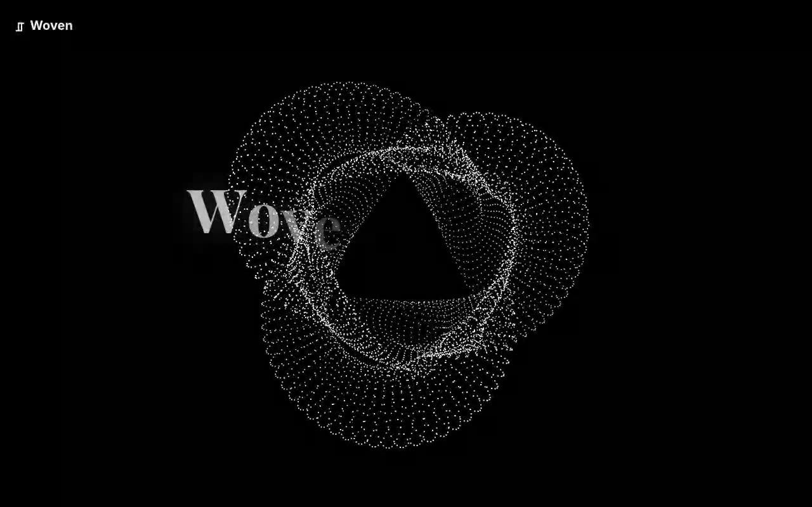

# Woven by Light — Interactive GPU Particle Hero Section (React + Three.js + Framer Motion)

[](./demo.mp4)

An interactive hero section featuring 50,000 GPU particles sampled onto a rotating `TorusKnotGeometry`, forming a shimmering "woven silk" tapestry that recoils from the cursor and springs back. Built by integrating the `WovenLightHero` shadcn-style component into a Vite + React + TypeScript + Tailwind CSS v4 project, with a Playfair Display headline that reveals letter-by-letter via Framer Motion. The purely procedural visual — no image assets, only Three.js `PointsMaterial` — makes this a compelling above-the-fold landing hero for creative and tech brands. Generated with Claude Fable 5.

## Stack

React, TypeScript, Vite, Tailwind CSS v4, Three.js, Framer Motion

## Run

```bash
npm install
npm run dev      # http://localhost:5173
npm run build    # tsc --noEmit + production build
npm run verify   # headless Chromium checks + screenshots
```

## Component integration notes (per the prompt)

The prompt asked to integrate the component into a shadcn-structured, Tailwind +
TypeScript codebase. This project is set up exactly that way:

- **Components path → `@/components/ui`.** shadcn's default registry installs
  primitives into `components/ui` and the demo imports
  `@/components/ui/woven-light-hero`. The `@` alias is wired in both
  `vite.config.ts` and `tsconfig.json` (`"@/*": ["./src/*"]`), so the component
  lives at `src/components/ui/woven-light-hero.tsx` and resolves identically to
  a shadcn project. Keeping the `ui` folder matters because shadcn's CLI, its
  `components.json`, and every generated import assume that path — diverging
  from it breaks `npx shadcn@latest add ...` and cross-component imports.
- **Dependencies installed:** `three`, `framer-motion` (+ `@types/three` for TS).
- **State / props:** the component takes no props and manages its own state via
  `useAnimation()` (entrance choreography) and a Three.js render loop driven by
  `requestAnimationFrame`. Mouse position drives a repel-and-return force on the
  particle field. No context providers required.
- **Assets:** the design needs no images — the visual is fully procedural
  (particles + GLSL-free `PointsMaterial`). The only assets are the **Playfair
  Display** and **Inter** fonts, which are **vendored locally** under
  `public/assets/fonts/` and declared via `@font-face` in `src/index.css`. The
  original component injected these from Google Fonts at runtime; that hotlink
  was removed so the hero renders fully offline.
- **Responsive:** headline scales `text-6xl → md:text-8xl`; the canvas tracks
  `window` size on resize; layout is centered and fluid down to mobile.
- **Best placement:** an above-the-fold landing/hero section.

### Setting up a fresh shadcn project (if you don't have one)

```bash
npm create vite@latest my-app -- --template react-ts
cd my-app
npm install tailwindcss @tailwindcss/vite     # Tailwind v4
npx shadcn@latest init                        # creates components.json, sets @/components/ui
npm install three framer-motion @types/three
# then drop woven-light-hero.tsx into src/components/ui/
```

## Verification

`npm run verify` boots `vite preview`, drives headless Chromium, and asserts:
WebGL canvas mounts with a live GL context, the headline reads "Woven by Light"
in Playfair Display and settles to full opacity, the Inter subheadline and
"Explore the Weave" pill render, the nav brand shows, both fonts load from the
local woff2 files, and there are **no console errors**. Desktop + mobile
screenshots are written to `screenshots/`.

---

Part of the [Hero sections](../) collection in the [claude-directory](../../) — an open-source gallery of AI-generated UI built with Claude Fable 5. [Browse the live gallery](https://pulkitxm.com/claude-directory).
