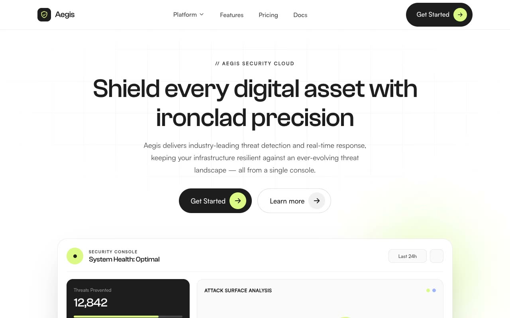

# Aegis Console — Precision-Grid Cybersecurity SaaS Landing Page (Vanilla HTML + CSS + JS)

[](./demo.mp4)

A multi-section marketing landing page for **Aegis**, a fictional enterprise cybersecurity platform, built in a "Precision Grid" design language — a bright, engineering-forward SaaS aesthetic on a white/bone canvas with a single electric-lime accent (`#DCF986`). The centerpiece is a live security console product mockup with an animated SVG line chart that draws itself via `stroke-dashoffset`, pulsing status dots, and count-up metrics. Display type uses Clash Grotesk over Satoshi body text. Motion includes staggered fade-and-rise on load, IntersectionObserver scroll reveals, and a floating "real-time monitoring" pill — all respecting `prefers-reduced-motion`. Generated with Claude Fable 5.

## Run

This is a static project — open `index.html` in a browser, or serve the folder:

```sh
python3 -m http.server 8000
```

See `prompt.md` for the full build spec; `demo.mp4` shows it in motion.

---

Part of the [Landing pages](../) collection in the [claude-directory](../../) — an open-source gallery of AI-generated UI built with Claude Fable 5. [Browse the live gallery](https://pulkitxm.com/claude-directory).
