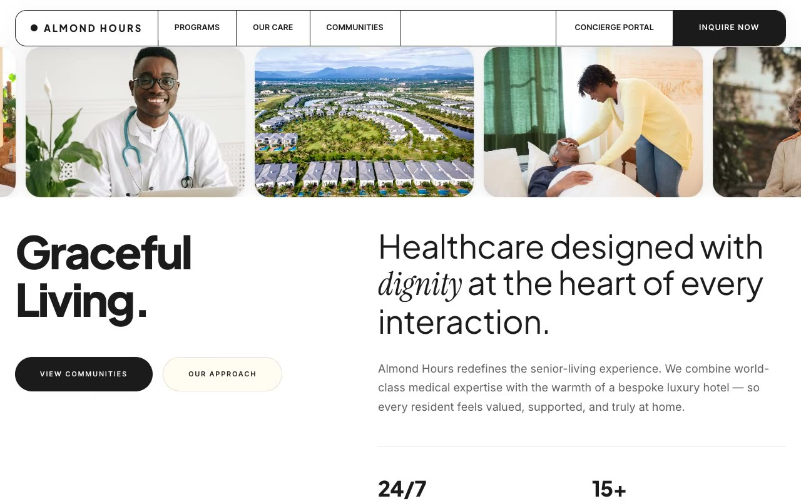

# Almond Hours — Warm Clinical Editorial Senior-Living Landing Page (Vanilla HTML + CSS + JS)

[](./demo.mp4)

A luxury senior-living and dignified-care marketing landing page for **Almond Hours**, built in a "Warm Clinical Editorial" design language — the quiet restraint of a printed lifestyle monograph fused with the trust of a bespoke private clinic. The page sits on crisp near-white paper anchored by almond-ink neutrals (`#1B1B1B`) with a single butter-cream tint, generous rounded radii, and hairline borders. Signature interactions include a sticky mega-menu pill nav with vertical-flip hovers, an infinite image marquee, a horizontal programs accordion that morphs width on hover, a single-open FAQ with a morphing plus/minus icon, and a cursor-reveal wordmark whose radial CSS mask follows a crosshair to reveal color-cycling text. All fonts are vendored locally for offline use. Generated with Claude Fable 5.

## Run

This is a static project — open `index.html` in a browser, or serve the folder:

```sh
python3 -m http.server 8000
```

See `prompt.md` for the full build spec; `demo.mp4` shows it in motion.

---

Part of the [Landing pages](../) collection in the [claude-directory](../../) — an open-source gallery of AI-generated UI built with Claude Fable 5. [Browse the live gallery](https://pulkitxm.com/claude-directory).
