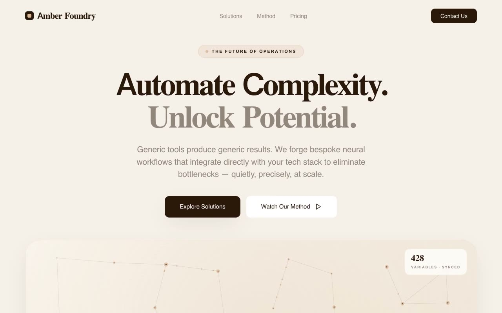

# Amber Foundry — Enterprise AI Consultancy Landing Page (HTML + CSS + Vanilla JS)

[](./demo.mp4)

A single-page marketing landing site for **Amber Foundry**, a fictional enterprise-AI consultancy, built in a "Warm Editorial Intelligence" design language — a quiet, paper-and-amber aesthetic that feels like a luxury strategy firm crossed with a scientific journal, the opposite of the typical neon-on-black AI startup. The hero renders a self-contained canvas "neural foundry" graphic — an animated amber node-and-edge network with flowing edge particles, no external image — paired with a partner marquee, an auto-advancing interactive split panel with built-out mock UI cards, a 12-column method bento grid, and one dramatic dark-brown pricing section. Typography pairs Host Grotesk with Halant serif over Inter body, all sitting on warm cream paper (`#F6F0E9`). Generated with Claude Fable 5.

## Run

This is a static project — open `index.html` in a browser, or serve the folder:

```sh
python3 -m http.server 8000
```

See `prompt.md` for the full build spec; `demo.mp4` shows it in motion.

---

Part of the [Landing pages](../) collection in the [claude-directory](../../) — an open-source gallery of AI-generated UI built with Claude Fable 5. [Browse the live gallery](https://pulkitxm.com/claude-directory).
