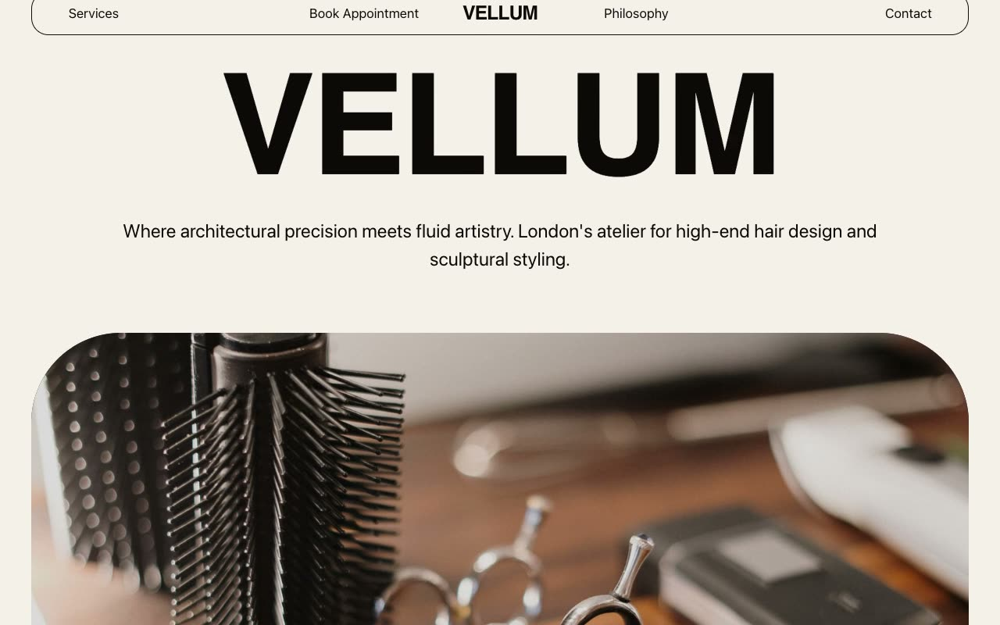

# Amberhaus — Luxury Pet Boutique & Care Atelier Landing Page (HTML + CSS + Vanilla JS)

[](./demo.mp4)

A multi-section marketing landing page for **Amberhaus**, a fictional high-end pet boutique and care atelier, built in a "Warm Amber Boutique" design language — a quiet, editorial look that reads like a printed lifestyle monograph about pampered pets rather than a generic pet-store site. Everything sits on crisp warm-white paper punctuated by a single saturated amber-gold accent (`#D97706`) and a butter-cream tint. Signature features include a custom amber paw-print cursor page-wide, a triptych hero with auto-crossfading image sliders and parallax center text, a 300vh horizontal-scroll sticky story track, vertical marquee testimonials with alternating up/down columns, and a spring-eased floating menu. Typography mixes Bricolage Grotesque display, Inter body, and Playfair Display italic flourish. Generated with Claude Fable 5.

## Run

This is a static project — open `index.html` in a browser, or serve the folder:

```sh
python3 -m http.server 8000
```

See `prompt.md` for the full build spec; `demo.mp4` shows it in motion.

---

Part of the [Landing pages](../) collection in the [claude-directory](../../) — an open-source gallery of AI-generated UI built with Claude Fable 5. [Browse the live gallery](https://pulkitxm.com/claude-directory).
