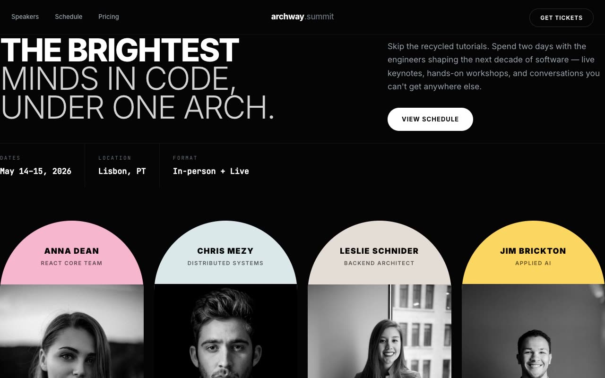

# Archway Summit — Developer Conference Landing Page (HTML + CSS + Vanilla JS)

[](./demo.mp4)

A multi-section marketing landing page for **Archway Summit**, a fictional developer conference, built in a "Gallery Arch" design language — a near-black editorial gallery where each headline speaker is framed inside a tall, pastel, museum-style arch, like portraits hung in a modern art hall. Contrast comes from hard black negative space (`#050505`) against candy-pastel arch cards (pink, blue, beige, yellow), oversized uppercase Inter display type, and monospace timestamps. The speaker arch section features grayscale portraits that turn full-color and lift on hover; other sections include a day-1/day-2 schedule toggle driven by vanilla JS, a logo strip, native `<details>` FAQ accordions, and an inverted white footer/CTA. Motion uses IntersectionObserver scroll reveals, card hover lifts, and arrow-button rotations. Generated with Claude Fable 5.

## Run

This is a static project — open `index.html` in a browser, or serve the folder:

```sh
python3 -m http.server 8000
```

See `prompt.md` for the full build spec; `demo.mp4` shows it in motion.

---

Part of the [Landing pages](../) collection in the [claude-directory](../../) — an open-source gallery of AI-generated UI built with Claude Fable 5. [Browse the live gallery](https://pulkitxm.com/claude-directory).
